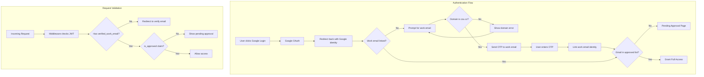

# Work Email Authentication System

## Architecture Overview



## Validation Flow

**Two-stage validation:**

1. **Before OTP (Domain Check)**: Validate email ends with `@studenti.czu.cz` or `@pef.czu.cz`

   - Client-side: Immediate feedback
   - Server-side: Validated before `signInWithOtp` is called

2. **After OTP (Approval Check)**: Check if specific email is in `approved_emails` table

   - Embedded in JWT via custom claims hook
   - Checked on every request via middleware

## Database Schema (Supabase Migrations)

Two tables with RLS policies managed entirely in Supabase:

1. **`approved_emails`** - Pre-approved specific email addresses (admin-managed)
2. **`user_profiles`** - User data with role and verified work email
```sql
-- Key tables structure
create table public.approved_emails (
  id uuid primary key default gen_random_uuid(),
  email text unique not null,
  created_by uuid references auth.users(id),
  created_at timestamptz default now(),
  constraint valid_czu_domain check (
    email like '%@studenti.czu.cz' or email like '%@pef.czu.cz'
  )
);

create table public.user_profiles (
  id uuid primary key references auth.users(id) on delete cascade,
  role text not null default 'user' check (role in ('user', 'admin')),
  verified_work_email text unique,
  google_email text,
  created_at timestamptz default now(),
  updated_at timestamptz default now()
);
```


## Allowed Domains (Hardcoded Constants)

```typescript
// lib/constants/auth.ts
export const ALLOWED_WORK_EMAIL_DOMAINS = [
  'studenti.czu.cz',
  'pef.czu.cz',
] as const;

export const isValidWorkEmailDomain = (email: string): boolean => {
  const domain = email.split('@')[1]?.toLowerCase();
  return ALLOWED_WORK_EMAIL_DOMAINS.includes(domain as any);
};
```

## Supabase Configuration Changes

Update [`supabase/config.toml`](supabase/config.toml):

```toml
[auth]
enable_manual_linking = true        # Required for work email linking
enable_anonymous_sign_ins = false   # Block anonymous access

[auth.email]
enable_signup = false               # Block direct email/password signup
enable_confirmations = false        # We use OTP for work email, not signup confirmation

[auth.external.google]
enabled = true
client_id = "env(GOOGLE_CLIENT_ID)"
secret = "env(GOOGLE_CLIENT_SECRET)"
```

## Security Lockdown (Google OAuth Only)

**Goal**: Users can ONLY authenticate via Google OAuth + work email verification. All other methods are blocked.

### Blocked Scenarios

| Attack Vector                               | How It's Blocked                                    |

| ------------------------------------------- | --------------------------------------------------- |

| Direct email/password signup                | `enable_signup = false` in auth.email               |

| Other OAuth providers (Apple, GitHub, etc.) | All providers disabled except Google                |

| Anonymous access                            | `enable_anonymous_sign_ins = false`                 |

| Access without verified work email          | Middleware checks `verified_work_email` JWT claim   |

| Unverified/fake work email                  | OTP verification required before linking            |

| Non-CZU domain emails                       | Domain validation (client + server + DB constraint) |

| Access without approval                     | Middleware checks `is_approved` JWT claim           |

### Optional: `before_user_created` Hook (Extra Layer)

Postgres hook to reject any user not created via Google:

```sql
create or replace function public.reject_non_google_signup(event jsonb)
returns jsonb
language plpgsql
security definer
as $$
begin
  -- Only allow users created via Google OAuth
  if event->'user'->'app_metadata'->>'provider' != 'google' then
    return jsonb_build_object(
      'decision', 'reject',
      'message', 'Only Google login is allowed'
    );
  end if;
  return event;
end;
$$;
```

Enable in config:

```toml
[auth.hook.before_user_created]
enabled = true
uri = "pg-functions://postgres/public/reject_non_google_signup"
```

### Custom Access Token Hook

Postgres function to embed claims in JWT:

```sql
create or replace function public.custom_access_token_hook(event jsonb)
returns jsonb
language plpgsql
security definer
as $$
declare
  claims jsonb;
  user_role text;
  work_email text;
  is_approved boolean;
begin
  -- Get user profile data
  select role, verified_work_email into user_role, work_email
  from public.user_profiles
  where id = (event->>'user_id')::uuid;

  -- Check if work email is in approved list
  select exists(
    select 1 from public.approved_emails where email = work_email
  ) into is_approved;

  -- Build custom claims
  claims := coalesce(event->'claims', '{}'::jsonb);
  claims := jsonb_set(claims, '{role}', to_jsonb(coalesce(user_role, 'user')));
  claims := jsonb_set(claims, '{verified_work_email}', to_jsonb(work_email));
  claims := jsonb_set(claims, '{is_approved}', to_jsonb(coalesce(is_approved, false)));

  return jsonb_set(event, '{claims}', claims);
end;
$$;
```

Enable in config:

```toml
[auth.hook.custom_access_token]
enabled = true
uri = "pg-functions://postgres/public/custom_access_token_hook"
```

## Development & Testing with Supabase MCP

The project has a `supabase/` directory with Supabase MCP (Model Context Protocol) integration available for:

1. **Testing custom claims hook**: Execute and iterate on the Postgres function directly
2. **Running migrations**: Apply and test database schema changes locally
3. **Querying tables**: Verify RLS policies and data integrity
4. **Debugging auth flow**: Inspect user sessions and JWT claims

**Useful MCP commands for development:**

- Run SQL queries to test the custom_access_token hook function
- Verify RLS policies by querying as different user roles
- Seed test data into approved_emails table
- Inspect auth.users and user_profiles tables

## Files to DELETE (Password-based auth leftovers)

These files are for email+password authentication and are **not needed** with Google OAuth:

| File | Reason |

|------|--------|

| `components/login-form.tsx` | Replaced by Google login button |

| `components/sign-up-form.tsx` | No separate signup - just Google OAuth |

| `components/forgot-password-form.tsx` | No passwords to forget |

| `components/update-password-form.tsx` | No passwords to update |

| `app/auth/sign-up/page.tsx` | No separate signup page |

| `app/auth/sign-up-success/page.tsx` | No signup confirmation |

| `app/auth/forgot-password/page.tsx` | No password reset |

| `app/auth/update-password/page.tsx` | No password update |

## Files to KEEP and MODIFY

| File | Changes |

|------|---------|

| `app/auth/login/page.tsx` | Replace with Google login button only |

| `app/auth/confirm/route.ts` | Keep - used for OTP verification |

| `app/auth/error/page.tsx` | Keep - error handling |

| `components/auth-button.tsx` | Show verified work email instead |

| `components/logout-button.tsx` | Keep as-is |

| `lib/supabase/proxy.ts` | Add work email + approval JWT claim checks |

## Files to CREATE

### Constants (1 file)

- `lib/constants/auth.ts` - Domain validation (10 lines)

### Database (2 files)

- `supabase/migrations/001_auth_tables.sql` - Tables + RLS
- `supabase/migrations/002_custom_claims_hook.sql` - JWT claims function

### Frontend (3 pages)

- `app/auth/login/page.tsx` - Rewrite with Google button only
- `app/auth/verify-work-email/page.tsx` - Work email + OTP form
- `app/auth/pending-approval/page.tsx` - Simple "pending" message
- `app/admin/users/page.tsx` - Approved emails table (admin only)

### Components (2 files)

- `components/google-login-button.tsx` - Single OAuth button
- `components/work-email-form.tsx` - Email input + OTP verification

## Key Security Features (Handled by Supabase)

1. **RLS Policies**:

   - Users can only read/update their own profile
   - Only admins can manage approved emails
   - Approved emails table viewable only by admins

2. **Custom JWT Claims Hook**:

   - Runs on every token refresh
   - Embeds role, verified_work_email, and is_approved directly in JWT
   - No additional DB queries needed for authorization checks

3. **Domain Validation**:

   - Client-side validation for UX (immediate feedback)
   - Server-side validation before sending OTP
   - Database constraint ensures only valid domains in approved_emails

## Authentication Flow Details

### Step 1: Google Login

User clicks Google login button, Supabase handles OAuth flow.

### Step 2: Work Email Input with Domain Validation

```typescript
// Validate domain before sending OTP
if (!isValidWorkEmailDomain(workEmail)) {
  throw new Error('Email must be @studenti.czu.cz or @pef.czu.cz');
}

// Send OTP to work email (only after domain validation passes)
const { error } = await supabase.auth.signInWithOtp({
  email: workEmail,
  options: { shouldCreateUser: false }
});
```

### Step 3: OTP Verification and Identity Linking

```typescript
// After user enters OTP, verify and link
const { error } = await supabase.auth.verifyOtp({
  email: workEmail,
  token: otpCode,
  type: 'email'
});

// Link the email identity to current Google user
const { error } = await supabase.auth.linkIdentity({
  provider: 'email'
});
```

### Step 4: Middleware Validation

Check JWT claims for `verified_work_email` and `is_approved` on every request to protected routes.

## Estimated Complexity

| Task | Complexity | Lines of Code |

|------|------------|---------------|

| Delete old auth files | Trivial | -500 lines |

| Security lockdown config | Trivial | ~20 lines TOML |

| Database migration | Low | ~50 lines SQL |

| JWT claims hook | Low | ~30 lines SQL |

| Constants + validation | Trivial | ~15 lines |

| Middleware update | Low | ~20 lines |

| Google login page | Low | ~30 lines |

| Work email form | Medium | ~100 lines |

| Admin UI | Low | ~80 lines |

**Total new code**: ~325 lines (vs ~500 lines deleted)

## Simplicity Principles

1. **No tRPC for auth** - Use Supabase client directly (fewer layers)
2. **No separate services** - Business logic in Supabase (RLS + hooks)
3. **Minimal components** - Reuse shadcn/ui, no custom abstractions
4. **Database-first validation** - Constraints + RLS handle security
5. **JWT claims for authorization** - No per-request DB lookups