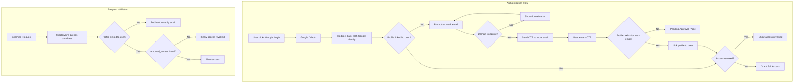

# Work Email Authentication System

## Architecture Overview



## Validation Flow

**Two-stage validation:**

1. **Before OTP (Domain Check)**: Validate email ends with `@studenti.czu.cz` or `@pef.czu.cz`

   - Client-side: Immediate feedback
   - Server-side: Validated before `signInWithOtp` is called

2. **After OTP (Profile Linking)**: Check if a profile exists for the verified work email

   - If profile exists with that work_email → link profile to auth.user
   - If no profile exists → show "Pending Approval" (admin must create profile first)
   - Checked on every request via middleware

## Database Schema (Supabase Migrations)

Two tables with **no RLS** - all access control is handled in Next.js:

1. **`users`** - Custom table to sync with auth.users (Google OAuth), synced via Next.js server actions
2. **`profiles`** - User authentication profile data with role and access control

**Important**: No Supabase functions, triggers, or RLS policies. All business logic lives in Next.js.

Use MODDATETIME extension to set the `updated_at` column on every update.

```sql
-- Users table to sync with auth.users (Google OAuth)
-- Note: Synced via Next.js server actions, not database triggers
create table public.users (
  id uuid primary key references auth.users(id) on delete cascade,
  email text not null,
  name text,
  picture text,
  created_at timestamptz default now() not null,
  updated_at timestamptz default now() not null
);

-- Role enum for profiles (authorization)
create type public.profile_role as enum ('student', 'team_leader', 'coach', 'admin');

-- Profiles table (pre-created by admin, linked to user after verification)
-- Focus: Authentication and authorization only
create table public.profiles (
  id uuid primary key default gen_random_uuid(),
  name text not null,
  user_id uuid unique references public.users(id) on delete set null,  -- linked after OTP verification
  work_email text unique not null,
  role public.profile_role not null default 'student',
  removed_access timestamptz,  -- null = active, set = revoked
  removed_access_by uuid references public.profiles(id) on delete set null,
  created_at timestamptz default now() not null,
  updated_at timestamptz default now() not null,
  constraint valid_czu_domain check (
    work_email like '%@studenti.czu.cz' or work_email like '%@pef.czu.cz'
  )
);

-- Indexes for auth queries
create index profiles_user_id_idx on public.profiles(user_id);
create index profiles_work_email_idx on public.profiles(work_email);
```

### Entity Relationships

```
┌─────────────────┐       ┌─────────────────┐
│   auth.users    │       │    profiles     │
│  (Supabase)     │       │  (Auth only)    │
├─────────────────┤       ├─────────────────┤
│ id (uuid)       │◄──┐   │ id (uuid)       │
│ email (google)  │   │   │ name            │
│ ...auth fields  │   └───│ user_id (1:1)   │
└─────────────────┘       │ work_email      │
                          │ role (enum)     │
                          │ removed_access  │
                          │ removed_access_by│──┐
                          │ created_at      │  │
                          │ updated_at      │  │
                          └─────────────────┘  │
                                    ▲          │
                                    └──────────┘ (self-reference)
```

### Verification Logic

- **Unverified**: `profiles.user_id IS NULL` → User logged in with Google but hasn't verified work email
- **Pending Approval**: Work email verified via OTP, but no profile exists with that email
- **Verified & Active**: `profiles.user_id IS NOT NULL AND profiles.removed_access IS NULL`
- **Access Revoked**: `profiles.removed_access IS NOT NULL`

## Constants

```typescript
// lib/constants/auth.ts
export const ALLOWED_WORK_EMAIL_DOMAINS = [
  'studenti.czu.cz',
  'pef.czu.cz',
] as const;

export const isValidWorkEmailDomain = (email: string): boolean => {
  const domain = email.split('@')[1]?.toLowerCase();
  return ALLOWED_WORK_EMAIL_DOMAINS.includes(domain as any);
};

// Profile roles (matches database enum)
export const PROFILE_ROLES = ['student', 'team_leader', 'coach', 'admin'] as const;
export type ProfileRole = typeof PROFILE_ROLES[number];

// Role hierarchy for permission checks
export const ROLE_HIERARCHY: Record<ProfileRole, number> = {
  student: 0,
  team_leader: 1,
  coach: 2,
  admin: 3,
} as const;

export const hasMinimumRole = (userRole: ProfileRole, requiredRole: ProfileRole): boolean => {
  return ROLE_HIERARCHY[userRole] >= ROLE_HIERARCHY[requiredRole];
};
```

## Supabase Configuration Changes

Update [`supabase/config.toml`](supabase/config.toml):

```toml
[auth]
enable_manual_linking = true        # Required for work email linking
enable_anonymous_sign_ins = false   # Block anonymous access

[auth.email]
enable_signup = false               # Block direct email/password signup
enable_confirmations = false        # We use OTP for work email, not signup confirmation

[auth.external.google]
enabled = true
client_id = "env(GOOGLE_CLIENT_ID)"
secret = "env(GOOGLE_CLIENT_SECRET)"
```

### Profile Verification (Next.js Middleware)

All verification logic lives in Next.js middleware, not in Supabase:

- **Profile Linked**: Check `profiles.user_id` matches current auth.user.id
- **Access Active**: Check `profiles.removed_access IS NULL`
- **User Role**: Read `profiles.role` column (student, team_leader, coach, admin)

This approach:

- Keeps all business logic in Next.js (single source of truth)
- Allows real-time updates (e.g., instant access revocation)
- Admin pre-creates profiles, users link via work email verification
- Supabase only handles auth + data storage (no custom hooks or functions)

## Development & Testing with Supabase MCP

The project has a `supabase/` directory with Supabase MCP (Model Context Protocol) integration available for:

1. **Running migrations**: Apply and test database schema changes locally
2. **Debugging auth flow**: Inspect user sessions and profile data
3. **Testing verification logic**: Query profiles table for auth checks

**Useful MCP commands for development:**

- Seed test data into profiles table for auth testing
- Inspect auth.users and profiles tables
- Test profile linking and access revocation queries

## Key Security Features

### Supabase (Data Layer Only)

1. **Database Constraints**:

   - Domain constraint ensures only valid CZU domains in profiles
   - Unique constraints on work_email, user_id

2. **No RLS or Functions**:

   - No Row Level Security policies
   - No database triggers or functions
   - All access control handled by Next.js

### Next.js (Application Layer - All Business Logic)

1. **Middleware Verification**:

   - Queries `profiles` table for linked user_id
   - Checks `removed_access` is null for active access
   - Enforces role-based route protection
   - Real-time verification (instant access revocation)

2. **Domain Validation** (in server actions):

   - Client-side validation for UX (immediate feedback)
   - Server-side validation before sending OTP
   - Validates email format and CZU domain

3. **Access Management** (in server actions):

   - Admin sets `removed_access` timestamp and `removed_access_by` profile
   - Immediate effect on next request
   - Audit trail of who revoked access and when

## Authentication Flow Details

### Step 1: Google Login

User clicks Google login button, Supabase handles OAuth flow.

### Step 2: Work Email Input with Domain Validation

```typescript
// Validate domain before sending OTP
if (!isValidWorkEmailDomain(workEmail)) {
  throw new Error('Email must be @studenti.czu.cz or @pef.czu.cz');
}

// Send OTP to work email (only after domain validation passes)
const { error } = await supabase.auth.signInWithOtp({
  email: workEmail,
  options: { shouldCreateUser: false }
});
```

### Step 3: OTP Verification and Profile Linking

```typescript
// After user enters OTP, verify it
const { error } = await supabase.auth.verifyOtp({
  email: workEmail,
  token: otpCode,
  type: 'email'
});

// Check if profile exists for this work email
const { data: profile } = await supabase
  .from('profiles')
  .select('id')
  .eq('work_email', workEmail)
  .single();

if (!profile) {
  // No profile exists - redirect to pending approval
  redirect('/auth/pending-approval');
}

// Link profile to current user
const { data: { user } } = await supabase.auth.getUser();
await supabase
  .from('profiles')
  .update({ 
    user_id: user.id,
    picture: user.user_metadata.avatar_url  // Default to Google picture
  })
  .eq('work_email', workEmail);
```

### Step 4: Middleware Validation

Query database for profile linked to current auth.user and check `removed_access IS NULL` on every request to protected routes.

```typescript
// Middleware check
const { data: profile } = await supabase
  .from('profiles')
  .select('id, role, removed_access')
  .eq('user_id', user.id)
  .single();

if (!profile) redirect('/auth/verify-work-email');
if (profile.removed_access) redirect('/auth/access-revoked');
// User has active access, continue...
```

## Estimated Complexity

| Task | Complexity | Lines of Code |

|------|------------|---------------|

| Delete old auth files | Trivial | -500 lines |

| Security lockdown config | Trivial | ~20 lines TOML |

| Database migration | Low | ~40 lines SQL (users, profiles, indexes) |

| Constants + validation | Trivial | ~25 lines |

| Server actions (auth logic) | Medium | ~60 lines |

| Middleware update | Medium | ~50 lines (includes DB queries) |

| Google login page | Low | ~30 lines |

| Work email form + linking | Medium | ~120 lines |

| Pending approval page | Low | ~20 lines |

| Access revoked page | Low | ~20 lines |

**Total new code**: ~385 lines (vs ~500 lines deleted)

## Separation of Concerns

### Supabase (Auth + Storage Only)

- **Authentication**: Google OAuth flow, session management, OTP emails
- **Database**: Store profiles and users data (no RLS - Next.js handles access control)
- **No business logic**: No custom hooks, no stored procedures, no triggers, no functions

### Next.js (All Business Logic)

- **Middleware**: Profile verification, access checks, role-based routing
- **Server Actions**: Profile linking, access revocation
- **Validation**: Domain validation, input sanitization, business rules
- **Authorization**: Role hierarchy checks, permission enforcement
```
┌─────────────────────────────────────────────────────────────────┐
│                         Next.js                                  │
│  ┌─────────────┐  ┌─────────────┐  ┌─────────────────────────┐  │
│  │ Middleware  │  │   Server    │  │      Components         │  │
│  │ - Auth check│  │   Actions   │  │  - Login form           │  │
│  │ - Profile   │  │ - Link      │  │  - OTP verification     │  │
│  │   verify    │  │   profile   │  │  - Pending approval     │  │
│  │ - Role gate │  │ - Revoke    │  │  - Access revoked       │  │
│  │             │  │   access    │  │                         │  │
│  └─────────────┘  └─────────────┘  └─────────────────────────┘  │
│         │                │                     │                 │
│         └────────────────┼─────────────────────┘                 │
│                          ▼                                       │
│  ┌─────────────────────────────────────────────────────────────┐│
│  │              Supabase Client (data access only)             ││
│  └─────────────────────────────────────────────────────────────┘│
└─────────────────────────────────────────────────────────────────┘
                           │
                           ▼
┌─────────────────────────────────────────────────────────────────┐
│                        Supabase                                  │
│  ┌─────────────────────┐  ┌─────────────────────────────────┐   │
│  │   Auth Service      │  │         PostgreSQL              │   │
│  │  - Google OAuth     │  │  - profiles table               │   │
│  │  - OTP emails       │  │  - users table                  │   │
│  │  - Session mgmt     │  │  - No RLS (Next.js handles)     │   │
│  └─────────────────────┘  └─────────────────────────────────┘   │
└─────────────────────────────────────────────────────────────────┘
```


## Simplicity Principles

1. **Business logic in Next.js** - Server actions and middleware handle all rules
2. **Supabase for storage only** - No hooks, no custom functions, no RLS, just tables
3. **Minimal components** - Reuse shadcn/ui, no custom abstractions
4. **Direct database queries** - Query profiles table for verification and access status
5. **Admin-first onboarding** - Admin creates profiles, users link via work email verification

# Common Traps to Avoid

1. The auth flow will get stuck once the user is redirected back to the nextjs app from supabase.