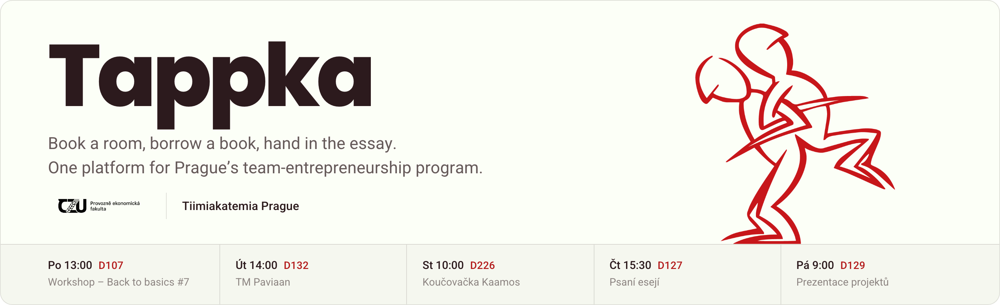
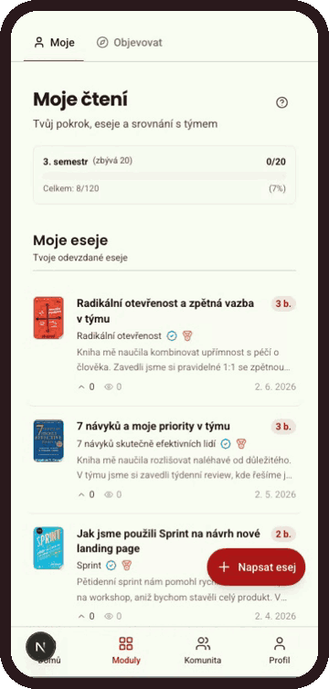
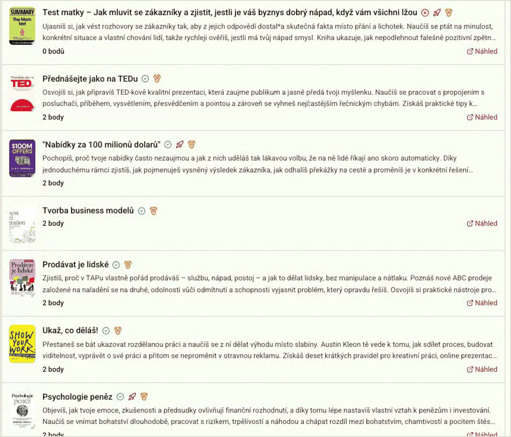
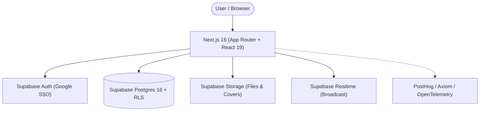

<p align="center">
  
</p>

<p align="center">
  <a href="https://tiimi.cz">Production</a> •
  <a href="https://preview.tiimi.cz">Preview</a> •
  <a href="#quick-start">Quick Start</a> •
  <a href="#modules">Modules</a> •
  <a href="#architecture--tech-stack">Tech Stack</a> •
  <a href="#testing">Testing</a> •
  <a href="CONTRIBUTING.md">Contributing</a>
</p>

---

## About Tappka

**Tappka** is the digital campus and workspace for [Tiimiakatemia Prague](https://tiimi.cz) — an innovative team-entrepreneurship program hosted at the **Faculty of Economics and Management, Czech University of Life Sciences Prague** ([ČZU PEF](https://www.ip.pef.czu.cz/)).

Rooted in Finnish team learning and experiential education, students operate real team-companies, manage projects, engage in coaching, read management literature, and collaborate in shared physical spaces. Tappka replaces fragmented spreadsheets and ad-hoc tools with a single, modern platform tailored specifically to the Tiimiakatemia methodology.

---

## Modules

### Available to Users

The platform is currently in active daily use across two core pillars:

| Module | Purpose | Key Capabilities |
| :--- | :--- | :--- |
| **Room Reservations** (`/reservations`) | Team meeting space & workshop booking | Real-time availability, conflict prevention, day & week schedules, recurring reservations, and NFC/QR door poster scanning for instant on-site bookings |
| **Reading & Essay Bank** (`/cteni`, `/knihovna`) | Entrepreneurial literature & reflections | Book catalogue, barcode/QR camera scanning, loan checkouts & returns, essay submission workflow, peer reviews, and academic credit accounting |

#### In-App Showcase

<table>
  <tr>
    <td width="32%" valign="top">
      
      <p align="center"><sub>Mobile — reading progress, essays, team points</sub></p>
    </td>
    <td width="68%" valign="top">
      
      <p align="center"><sub>Desktop — curated reading list with per-book point values</sub></p>
    </td>
  </tr>
</table>

### In Development (Cohort Rollout)

Additional modules supporting deeper Tiimiakatemia practices are implemented in the codebase and undergoing staged rollout via cohort flags (`src/lib/feature-access.ts`):

| Module | Purpose | Scope |
| :--- | :--- | :--- |
| **Team Reflection & Diary** (`/tymova-reflexe`, `/tymovy-denik`) | Team learning journals & milestone reviews | Shared team logs, reflection prompts, annual retrospectives, and collective team agreements |
| **Coaching & Sessions** (`/koucovani`) | Individual & team coaching tracking | Session scheduling, coaching notes, action items, and personal development tracking |
| **Customer Meetings** (`/schuzky`) | Real-world business & client tracking | Client meeting logs, business outcomes, project pipeline, and sales milestones |
| **Tools & Diagnostics** (`/nastroje-techniky`, `/osobnostni-testy`) | Team diagnostics & methodology toolbox | Belbin team roles, MBTI & personality assessments, practical workshop tools |
| **Student & Team Portfolios** (`/portfolio`) | Competency & achievement showcases | Student credit checkpoints, essay summaries, project portfolios, and team profiles |
| **Birth Giving** (`/birth-giving`) | Team founding & milestone celebrations | Team birth-giving sessions, ceremonies, and retrospective records |

---

## Architecture & Tech Stack



- **Frontend & Fullstack Framework**: [Next.js 16](https://nextjs.org/) (App Router, React 19, Server Components, TypeScript Strict Mode).
- **UI & Design System**: [Tailwind CSS v4](https://tailwindcss.com/), [Radix UI](https://www.radix-ui.com/) primitives, custom shadcn/ui components, [Lucide React](https://lucide.dev/) icons, [Tiptap](https://tiptap.dev/) rich text editor, [Sonner](https://sonner.emilkowal.ski/) toasts.
- **Backend & Database**: [Supabase](https://supabase.com/) (PostgreSQL 16, Row Level Security, Supabase Auth with Google OAuth, Storage, Realtime Broadcast).
- **Database Modeling**: [Drizzle ORM](https://orm.drizzle.team/) for declarative schema modeling and deterministic SQL migrations; runtime data access via typed [`@supabase/supabase-js`](https://supabase.com/docs/reference/javascript/introduction) respecting RLS.
- **Testing**: [Vitest](https://vitest.dev/) (unit & component tests), [Testcontainers](https://testcontainers.com/) (isolated PostgreSQL 16 container for integration tests), [Playwright](https://playwright.dev/) (end-to-end user flows).
- **Observability**: [PostHog](https://posthog.com/) product analytics, [Axiom](https://axiom.co/) logging, and OpenTelemetry instrumentation.
- **Documentation**: [VitePress](https://vitepress.dev/) internal documentation site (`pnpm wiki`).

---

## Quick Start

### Prerequisites

Ensure you have the following installed on your machine:
- [Git](https://git-scm.com/)
- [Node.js](https://nodejs.org/) `>= 24.13.0` (managed via [mise](https://mise.jdx.dev/) or your preferred version manager)
- [pnpm](https://pnpm.io/) `>= 10.28.0`
- [Docker](https://www.docker.com/) (required to run the local Supabase instance)

> [!TIP]
> We recommend using [mise](https://mise.jdx.dev/) to automatically install and manage the exact Node.js and CLI tool versions specified in the repository.

<details>
<summary><strong>Installing mise & Docker (macOS & Windows)</strong></summary>

#### macOS
```bash
# Install mise
curl https://mise.run/zsh | sh

# Install tools configured in .mise.toml
mise install
mise doctor

# Install Docker Desktop if not already present
brew install --cask docker
```

#### Windows
```powershell
# Install mise and Docker Desktop using winget
winget install jdx.mise
winget install -e --id Docker.DockerDesktop

# Install tools configured in .mise.toml
mise install
mise doctor
```
</details>

---

### Installation & Local Run

1. **Clone the repository**:
   ```bash
   git clone https://github.com/spirit-of-tap/Tappka.git
   cd Tappka
   ```

2. **Install dependencies**:
   ```bash
   pnpm install
   ```

3. **Start the local development environment**:
   ```bash
   pnpm dev
   ```

   What `pnpm dev` does automatically:
   - Checks and initializes local environment variables (`.env.local`).
   - Boots the local Supabase container stack (PostgreSQL, Auth, Storage, Studio) via Docker.
   - Automatically applies migrations and exports schema types.
   - Launches Next.js dev server with inspect mode enabled.

4. **Access your local environment**:
   - **Web App**: [http://localhost:3000](http://localhost:3000)
   - **Supabase Studio**: [http://localhost:54323](http://localhost:54323)
   - **Local Email Inbox (Inbucket)**: [http://localhost:54324](http://localhost:54324)

---

## Available Scripts

| Command | Purpose |
| :--- | :--- |
| `pnpm dev` | Starts local Supabase and launches Next.js development server |
| `pnpm stop` | Stops the local Supabase Docker containers |
| `pnpm restart` | Gracefully restarts Supabase and restarts the dev server |
| `pnpm build` | Compiles and builds the production Next.js application |
| `pnpm start` | Runs the production-built Next.js server locally |
| `pnpm lint` | Runs ESLint across the codebase |
| `pnpm typecheck` | Validates TypeScript types across the entire project |
| `pnpm db:migrate` | Generates a new migration from Drizzle schema, applies it, and updates types |
| `pnpm db:doctor` | Runs migration integrity and local schema validation checks |
| `pnpm wiki` | Launches the internal VitePress documentation portal locally |

---

## Testing

Tappka enforces a comprehensive **4-layer testing strategy**. See [`docs/runbooks/testing.md`](docs/runbooks/testing.md) for full guidelines.

| Layer | Command | Requirements | Scope |
| :--- | :--- | :--- | :--- |
| **Unit** | `pnpm test:unit` | None | Pure business logic in `src/lib/*` (co-located `*.test.ts`) |
| **Component** | `pnpm test:component` | None | React component rendering via jsdom & Testing Library (`*.test.tsx`) |
| **Integration** | `pnpm test:integration` | Docker | DB schema, constraints, triggers, and RLS policies tested against an isolated Testcontainer PostgreSQL 16 instance with automatic transaction rollback |
| **E2E** | `pnpm test:e2e` | Supabase + App Build | End-to-end user workflows with Playwright |

Run unit and component tests anytime:
```bash
pnpm test          # Runs unit + component test suites
pnpm test:watch    # Watch mode for unit tests
```

---

## Database & Schema Management

We treat `db/schema/*.ts` (Drizzle) as the **single source of truth** for all tables, columns, indexes, enums, and Row Level Security (RLS) policies.

- **Schema changes**: Edit `db/schema/*.ts`, then execute `pnpm db:migrate`.
- **Functions & Triggers**: Run `pnpm db:generate:custom` to scaffold a migration, author the SQL function/trigger, apply via `pnpm db:up`, and record the Drizzle journal.
- **Zero Schema Drift**: Migrations are strictly versioned under `supabase/migrations/` and validated in CI with `pnpm db:check-integrity`.
- **Data Access**: Application queries use [`@supabase/supabase-js`](https://supabase.com/docs/reference/javascript/introduction) with auto-generated TypeScript definitions (`pnpm db:types`) to strictly honor Postgres Row Level Security.

Refer to [`docs/data-layer.md`](docs/data-layer.md) for deep-dive documentation on the data architecture.

---

## Documentation & Wiki

The repository includes a complete internal documentation site built with [VitePress](https://vitepress.dev/).

To browse the docs locally:
```bash
pnpm wiki
```

It covers:
- Data layer architecture & RLS design patterns ([`docs/data-layer.md`](docs/data-layer.md))
- Testing runbooks and testcontainer setup ([`docs/runbooks/testing.md`](docs/runbooks/testing.md))
- Tiimiakatemia portfolio specs & sheets ([`docs/portfolio-sheets.md`](docs/portfolio-sheets.md))
- UI/UX conventions and accessibility guidelines ([`DESIGN.md`](DESIGN.md))
- Coding rules & guidelines for agentic pair programming ([`AGENTS.md`](AGENTS.md))

---

## Deployments

| Environment | URL | Deployment Trigger |
| :--- | :--- | :--- |
| **Production** | [tiimi.cz](https://tiimi.cz) | Pull request merged to `production` branch |
| **Preview** | [preview.tiimi.cz](https://preview.tiimi.cz) | Push to `preview` branch |
| **Local** | [localhost:3000](http://localhost:3000) | `pnpm dev` |

---

## Authors & Maintainers

Built by the Tiimiakatemia Prague team:
- **Ondřej Kulhavý** ([GitHub](https://github.com/ondrejkulhavy) • [LinkedIn](https://www.linkedin.com/in/ondrejkulhavy/))
- **Ondřej Schlossar** ([LinkedIn](https://www.linkedin.com/in/ond%C5%99ej-schlossar/))
- **Tomáš Protiva** ([LinkedIn](https://www.linkedin.com/in/tomprotiva/))

Special thanks to the [Tiimiakatemia Prague](https://tiimi.cz) community and the [Faculty of Economics and Management at CZU Prague](https://www.pef.czu.cz/) for their ongoing support.

---

## License & Contributing

Contributions are welcome! Please read our [**Contributing Guide**](CONTRIBUTING.md) and [**Design Guidelines**](DESIGN.md) before submitting pull requests.
