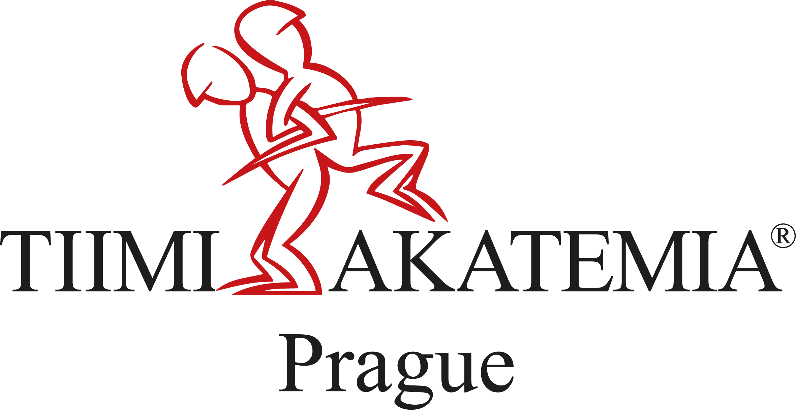
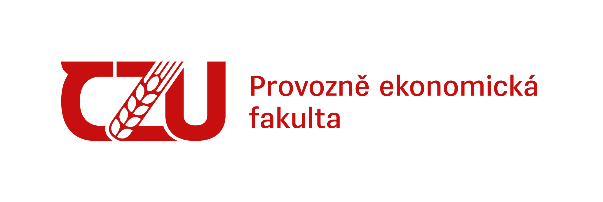

<div align="center" style="background: #fcfff7; padding: 2rem 1rem; border-radius: 16px;">
  <div style="display: flex; justify-content: center; align-items: center; gap: 2rem; margin-bottom: 1rem;">
    
    
  </div>

  <h1 style="font-family: Poppins, sans-serif; color: #b31b1b; font-weight: 800; font-size: 2.5rem; margin: 0.5rem 0;">
    Tappka
  </h1>

  <p style="font-family: Roboto, sans-serif; color: #555; font-size: 1rem; max-width: 480px; margin: 0.5rem auto;">
    All-in-one web app for <strong>Tiimiakatemia Prague</strong> — empowering teams with room booking, essay bank, and authentication.
  </p>

  <p style="font-family: Roboto, sans-serif; color: #2c1a1d; font-size: 0.85rem; margin-top: 1.5rem;">
    Made with ❤️ by
    <a href="https://www.linkedin.com/in/ond%C5%99ej-schlossar/" style="color: #b31b1b; text-decoration: none;">Ondřej Schlossar</a>,
    <a href="https://www.linkedin.com/in/ondrejkulhavy/" style="color: #b31b1b; text-decoration: none;">Ondřej Kulhavý</a>,
    <a href="https://www.linkedin.com/in/tomprotiva/" style="color: #b31b1b; text-decoration: none;">Tomáš Protiva</a>
  </p>
</div>

# Links

## Publicly available
- [Tappka](https://tiimi.cz)
- [Tappka preview](https://preview.tiimi.cz)

## Locally available when running the project
- [Tappka locally](http://localhost:3000)
- [Supabase locally](http://localhost:54323)
- [Supabase mail locally](http://localhost:54324)

## Other links

- [Blacksmith](https://app.blacksmith.sh/tiimiakatemiapragueit/runs/jobs) - CI/CD for the project
- [Supabase](https://supabase.comorg/zjdqjjekgwwysjkouxpf) - Database for the project
- [Vercel](https://vercel.com/spirit-of-taps-projects/tappka) - Hosting for the project
- [Cloudflare DNS](https://dash.cloudflare.com/09d0b565479ef597d4c1bfa2062078b5/tiimi.cz/dns/records) - DNS for the project
- [Axiom](https://app.axiom.co/spirit-of-tap-9eje) - Logging for the project

# Language

The project is written in english and will be written in english for better llm compatibility.
All czech should be just in localization files.

# Local Development

## Setup

1. Install git if already not installed - https://git-scm.com/install/
2. Install docker if already not installed - https://docs.docker.com/get-docker/
2. Install node.js v24.x with pnpm 10.x if already not installed - https://nodejs.org/en/download/
3. Install pnpm v10.x if you didn't choose it in the previous step

```bash
npm install -g pnpm@10.28.1
```

4. Clone the repository
```bash
git clone https://github.com/tappka/tappka.git
```
5. Navigate to the project directory -
```bash
cd tappka
```

## Running the project after setup

```bash
pnpm install
pnpm dev
```

The project will be available at [http://localhost:3000](http://localhost:3000)


# Supabase

Supabase database is developed locally and synced automatically whenever pushed. See [.github/workflows/deploy-supabase.yml](.github/workflows/deploy-supabase.yml) for more details.
Supabase Auth needs to be configured both on the project itself and in the local development environment.
Make sure that the project can run without setting up any environment variables, this is so that we can get new T's to start vibecoding without them giving up.

In case there is a conflict on the preview branch, the github action will reset the database and push the changes again. Therefore **do not store anything important in the preview database**.

# Recommended Tools

It is very nice to setup mcp with cursor for supabase. Look at [Supabase locally](http://localhost:54323) and go to the top for connection button. It will give you the option.
There are cursor rules made for this nextjs project.

# Publishing the project to the public

You can simply **push to the preview branch** and it will be deployed to the preview environment.
For production you will need to make a **pull request to the production branch** and it will be deployed to the production environment. You can approve it yourself, it's just for protection so that you don't accidentally deploy something to production.
