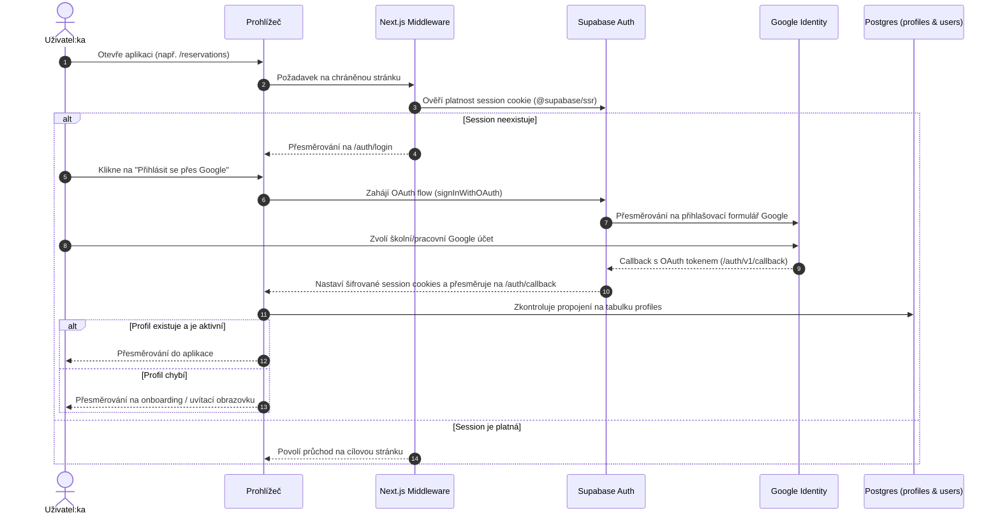
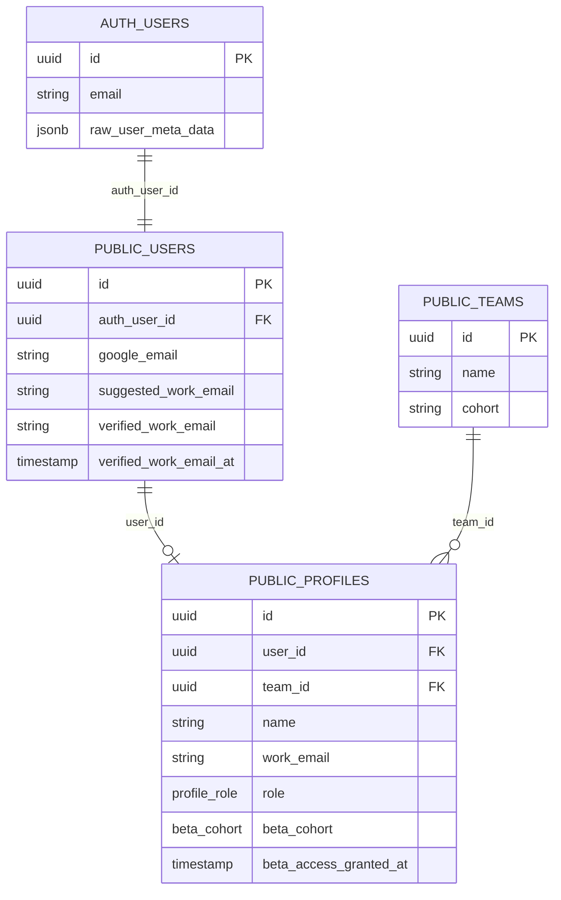

# Autentizace a správa oprávnění

Autentizační systém Tappky je navržen s ohledem na specifika univerzitního prostředí ČZU PEF, týmových firem a ochranu osobních údajů.

Tento dokument popisuje proces přihlašování, datový model identit, systém rolí a řízení přístupu k beta funkcím.

---

## 1. Tok přihlášení (Google Workspace SSO)

Všichni uživatelé se do Tappky přihlašují prostřednictvím **Google OAuth 2.0 Single Sign-On (SSO)**.



---

## 2. Oddělení identit a datový model

Tappka přísně odděluje technickou identitu přihlášeného účtu od aplikačního profilu studenta nebo kouče.

Model je rozdělen do tří vrstev:



### Proč toto rozdělení?
1. **Separace školních a firemních dat:** Studující často používají školní e-mail ČZU (`@pef.czu.cz`) pro přihlášení přes Google SSO, ale pro týmovou firmu vystupují pod firemním e-mailem (`@tymovaspol.cz`).
2. **Nezávislost na OAuth providerovi:** Kdyby se v budoucnu změnil poskytovatel přihlášení (např. integrace univerzitního Shibboleth / eduID), profily studentů a jejich historická data zůstanou nedotčena.
3. **Audit a bezpečnost:** Tabulka `users` obsahuje verifikaci e-mailů a časová razítka, zatímco tabulka `profiles` nese aplikační data (jméno, fotka, tým, role).

---

## 3. Uživatelské role a oprávnění

Role jsou uloženy v databázovém typu `profile_role`:

```sql
create type profile_role as enum ('student', 'mentor', 'coach', 'admin');
```

### Matice oprávnění

| Funkcionalita | Student:ka | Kouč:ka | Mentor:ka | Admin |
| :--- | :---: | :---: | :---: | :---: |
| Prohlížení a rezervace místností kampusu | Ano | Ano | Ano | Ano |
| Okamžitá rezervace u dveří (QR kód) | Ano | Ano | Ano | Ano |
| Správa místností kampusu a harmonogramů | Ne | Ne | Ne | Ano |
| Čtení knih v katalogu | Ano | Ano | Ano | Ano |
| Odevzdání vlastního eseje | Ano | Ne | Ne | Ano |
| Hodnocení a schvalování esejů (udělení bodů) | Ne | Ano | Ne | Ano |
| Záznam z individuálního koučování | Čtení svých | Plný zápis | Ne | Plný zápis |
| Zápis do týmového deníku a reflexe | Vlastní tým | Čtení svých | Čtení | Plný zápis |
| Účetní výkazy a týmové finance | Vlastní tým | Čtení svých | Ne | Plný přístup |
| Správa uživatelů, týmů a rolí | Ne | Ne | Ne | Ano |
| Globální přístup ke všem beta modulům | Dle kohorty | Dle kohorty | Dle kohorty | Vždy ano |

---

## 4. Řízení beta modulů a kohorty (A/B testing)

Nové funkce jsou do produkce nasazovány postupně. Přístup je řízen kódem v [`src/lib/feature-access.ts`](https://github.com/spirit-of-tap/Tappka/blob/production/src/lib/feature-access.ts):

```typescript
export const BETA_FEATURES = {
  customerMeetings: ["B"],
  coaching: ["B"],
  teamReflection: ["B"],
  teamDiary: ["B"],
  teamDocuments: ["B"],
  toolsTechniques: ["B"],
  personalityTests: ["B"],
  birthGiving: ["B"],
  portfolio: ["B"],
  dashboardMetrics: ["B"],
} as const;

export type BetaFeature = keyof typeof BETA_FEATURES;
export type BetaCohort = "A" | "B";

export function canAccessFeature(profile: AccessProfile | null | undefined, feature: BetaFeature): boolean {
  if (!profile) return false;
  if (profile.role === "admin") return true; // Admin má přístup vždy
  if (!profile.beta_access_granted_at) return false;
  const allowed = BETA_FEATURES[feature];
  return (allowed as readonly string[]).includes(profile.beta_cohort);
}
```

- **Administrátoři** mají přístup ke všem modulům automaticky.
- **Běžní uživatelé** mají přiřazenu kohortu (`beta_cohort`: `A` nebo `B`) a časové razítko udělení přístupu (`beta_access_granted_at`).
- Pokud uživatel nemá přístup, modul se buď nezobrazuje v navigaci, nebo je přesměrován na stránku `/moduly`, kde vidí stav dostupnosti a roadmapu.

---

## 5. Zabezpečení na úrovni databáze (RLS)

Aplikace nikdy nespoléhá pouze na frontendové či middleware kontroly. Všechna data jsou chráněna na úrovni PostgreSQL řádků (Row Level Security).

Příklad RLS politiky pro eseje:
```sql
-- Kdokoliv přihlášený může číst publikované eseje
create policy "Published essays are viewable by all authenticated users"
  on essays for select
  to authenticated
  using (status in ('published', 'reviewed'));

-- Pouze autor:ka může upravovat koncept svého eseje
create policy "Users can update their own draft essays"
  on essays for update
  to authenticated
  using (author_profile_id = (select id from profiles where auth_user_id = auth.uid()) and status = 'draft');
```
Veškerá data jsou tak stoprocentně chráněna přímo jádrem PostgreSQL.
