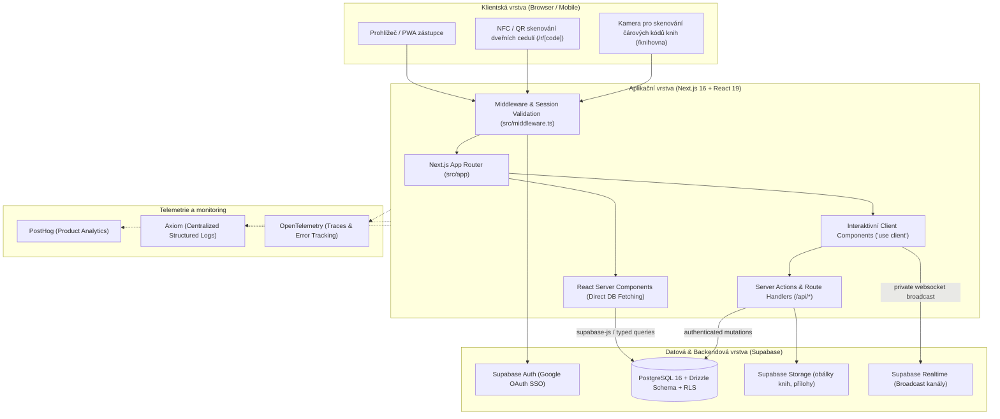

# Architektura aplikace Tappka

Tappka je digitální kampus a pracovní prostředí pro komunitu [Tiimiakatemia Prague](https://tiimi.cz) při Provozně ekonomické fakultě České zemědělské univerzity v Praze (ČZU PEF).

Tento dokument poskytuje ucelený pohled na architekturu celého systému, jeho hlavní domény, datové toky a technická rozhodnutí.

---

## 1. Kontext a cíl platformy

Tiimiakatemia je inovativní program zaměřený na týmové podnikání, zkušenostní učení a seberozvoj vycházející z finského modelu (Tiimiakatemia Jyväskylä). Studující zde nepíší klasické zkoušky, ale zakládají skutečné týmové společnosti (s.r.o. nebo z.s.), realizují reálné byznysové projekty, čtou odbornou literaturu, vedou týmové dialogy (Training Sessions) a absolvují koučovací sezení.

Dříve byla tato agenda rozptýlena v desítkách tabulek (Excel, Google Sheets), papírových evidencích a neformálních chatech.

**Tappka centralizuje celou metodiku do jediné aplikace:**
- **Provoz kampusu:** Rezervace týmových kanceláří a zasedacích místností včetně okamžitého bookování u dveří přes NFC / QR kódy.
- **Akademické a rozvojové toky:** Evidence přečtených knih, odevzdávání a recenzování esejů, schvalování bodů kouči:kami.
- **Týmová správa a governance:** Týmové smlouvy, vedoucí myšlenky, finanční směrnice, účetní výkazy (rozvahy a výsledovky).
- **Zpětná vazba a reflexe:** 9měsíční reflexní kalendáře, semestrální reflexe, diagnostika Rocket Model a Belbinovy role.
- **Byznys a pipeline:** Záznamy ze schůzek se zákazníky, sledování obratu a obchodních výsledků.

---

## 2. Diagram systémové architektury

Architektura Tappky staví na hybridním modelu Next.js (Server Components + App Router) spojeném s cloudovým backendem Supabase (PostgreSQL 16 s Row Level Security, Auth, Storage a Realtime):

---

## 3. Klíčové architektonické principy

### Server Components jako výchozí stav
V souladu s pravidly v [`AGENTS.md`](/runbooks/agents-and-code-style) je každá stránka a komponenta ve výchozím stavu **React Server Component**. 
- Kód běží přímo na serveru bez odesílání JavaScriptu do klienta.
- Dotazy do databáze probíhají přes `@/lib/supabase/server` s request-scoped cache přes `React.cache()` (např. profil přihlášeného uživatele v [`src/lib/auth/session.ts`](https://github.com/spirit-of-tap/Tappka/blob/production/src/lib/auth/session.ts)).
- Direktiva `"use client"` se používá pouze pro prvky vyžadující interaktivitu (formuláře, modální dialogy, přístup k foťáku pro skenování, časovače nebo real-time odběry).

### Databázová bezpečnost přímo v PostgreSQL (RLS)
Aplikační kód nepoužívá runtime ORM klientskou instanci, která by obcházela databázová práva.
- Schéma a migrace jsou deklarativně definovány přes **Drizzle ORM** v `db/schema/*.ts`.
- Dotazování za běhu probíhá výhradně přes **`@supabase/supabase-js`** pod identitou přihlášeného uživatele.
- Každá tabulka má striktně zapnuté **Row Level Security (RLS)** politiky. I kdyby došlo k chybě v aplikační logice na frontendu, databáze nikdy nevydá data cizího týmu ani neautorizované záznamy.

### Reaktivita bez zbytečné zátěže (Realtime Broadcast)
Místo náročného sledování databázových změn přes `postgres_changes` využívá Tappka výhradně model **Supabase Broadcast**:
- Privátní kanály se jmennou konvencí `scope:entity:id` (např. `reservations:room:107`).
- Události ve formátu snake_case (např. `reservation_created`, `slot_cancelled`).
- Čistý úklid a odhlášení posluchačů při unmountu komponent.

### Genderově neutrální a inkluzivní jazyk
Uživatelské rozhraní důsledně dodržuje pravidla inkluzivní češtiny popsané v [`DESIGN.md`](/architecture/design-system):
- Všude se používá tykání.
- Generické maskulinum je zakázáno. Místo závorek či lomítek (`autor(ka)`, `autor/ka`) se používá výhradně dvojtečkový zápis: `autor:ka`, `kouč:ka`, `čtenář:ka`.
- Kde je to možné, texty preferují opisné tvary, přítomný čas a přechodníky či podstatná jména slovesná (`studující`, `vedení týmu`, `recenzování`).

---

## 4. Přehled uživatelských rolí

V systému existují 4 základní uživatelské role definované enumem `profile_role` v [`db/schema/profiles.ts`](https://github.com/spirit-of-tap/Tappka/blob/production/db/schema/profiles.ts):

| Role | Kód v DB | Popis a oprávnění |
| :--- | :--- | :--- |
| **Student / Teampreneur** | `student` | Člen:ka týmové společnosti. Má přístup k rezervacím, četbě, odevzdávání esejů, týmovým reflexím, deníku a schůzkám svého týmu. |
| **Kouč:ka týmu** | `coach` | Certifikovaný kouč:ka provázející jeden nebo více týmů. Může hodnotit a schvalovat eseje, vést záznamy z koučování a prohlížet týmové finance. |
| **Mentor:ka** | `mentor` | Externí odborník:odbornice pro specifické projekty. Má nahlížecí přístup k vybraným projektům a konzultacím. |
| **Administrátor:ka** | `admin` | Správce celého kampusu. Může konfigurovat místnosti kampusu, otevírací dobu, spravovat role, týmy a má neomezený přístup k novým beta modulům. |

Kromě těchto rolí systém podporuje **staged beta rollout** pomocí kohort (A/B) řízený přes [`src/lib/feature-access.ts`](https://github.com/spirit-of-tap/Tappka/blob/production/src/lib/feature-access.ts), což umožňuje bezpečně testovat nové moduly na vybraných ročnících před celoškolním spuštěním.
