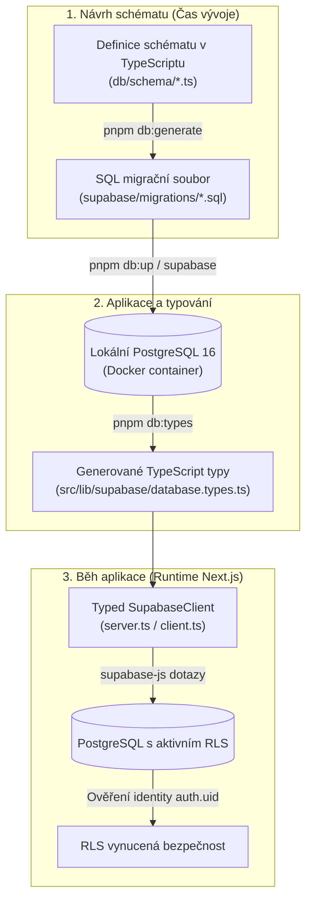
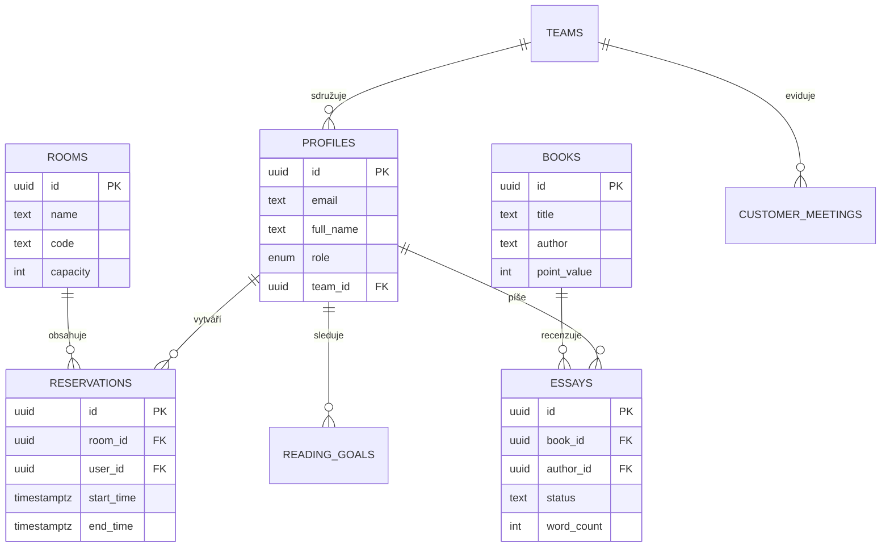

# Datová vrstva — Architektura a pracovní postupy

Tento dokument popisuje, jak v Tappce spolupracují databáze, TypeScript typy a dotazování, a jak s nimi efektivně pracovat v každodenním vývoji. Přečti si jej dříve, než začneš upravovat schéma, psát migrace nebo psát dotazovací kód.

---

## 1. Shrnutí v kostce (TL;DR)

- **Databáze:** Supabase PostgreSQL 16. Řízení přístupových práv je vynuceno na úrovni řádků pomocí **Row Level Security (RLS)**.
- **Zdroj pravdy pro schéma:** Schéma (tabulky, sloupce, indexy, RLS politiky) je deklarativně definováno v kódu pomocí **Drizzle ORM** (`db/schema/*.ts`).
- **Generování a aplikace migrací:** Nástroj `drizzle-kit` převádí změny schématu do SQL migrací; **Supabase CLI** je aplikuje do databáze.
- **Dotazování:** Aplikace komunikuje s databází **výhradně přes `@supabase/supabase-js`**. Každý dotaz je typově kontrolován proti automaticky generovaným typům (`src/lib/supabase/database.types.ts`).
- **Žádný runtime Drizzle:** Drizzle se v běžící aplikaci nikdy nespouští. V aplikaci není žádné runtime ORM a nesmí být přidáváno.

---

## 2. Diagram toku datové architektury



---

## 3. Třídílný model rozdělení odpovědnosti

V Tappce neexistuje jedno monolitické ORM. Místo toho tři specializované nástroje plní jasně vymezené úkoly:

| Oblast | Nástroj | Umístění | Kdy se spouští |
| :--- | :--- | :--- | :--- |
| **Definice schématu** (tabulky, sloupce, indexy, RLS) | **Drizzle ORM** | `db/schema/*.ts` | Pouze při vývoji |
| **Funkce a triggery** (Drizzle je neumí modelovat) | Čisté SQL | `supabase/migrations/*.sql` | Pouze při vývoji |
| **Generování migrací** | **drizzle-kit** | `pnpm db:generate` | Pouze při vývoji |
| **Aplikace migrací** | **Supabase CLI** | `pnpm db:up` / `db:migrate` | Při vývoji a nasazení |
| **Runtime dotazování** | **supabase-js** | `src/lib/**`, `src/app/**` | Za běhu aplikace |
| **TypeScript typy** | **Generované z DB** | `src/lib/supabase/database.types.ts` | Při změně schématu |

---

## 4. Schéma klíčových entit (ERD)



---

## 5. Jak funguje dotazování v kódu

Všichni tři klienti pro vytváření Supabase instance jsou typováni generovaným typem `Database`:

- `src/lib/supabase/server.ts` — `createClient()` pro React Server Components a Route Handlery.
- `src/lib/supabase/client.ts` — `createClient()` pro klientské komponenty (`"use client"`).
- `src/lib/supabase/admin.ts` — `createAdminClient()` se **service-role klíčem, který obchází RLS**. Používá se výhradně na serveru pro systémové úlohy (např. odesílání transakčních e-mailů nebo administrativní synchronizace). Nikdy se nesmí dostat do prohlížeče.

Díky typovému parametru `<Database>` je každý dotaz plně typově kontrolován:

```typescript
const { data, error } = await supabase.from('essays').select('*');
// data[0].word_count -> number
// data[0].neexistujici_sloupec -> chyba při kompilaci TypeScriptu!
```

Pomocné funkce pro dotazování vždy přebírají typovaného klienta:

```typescript
import type { SupabaseClient } from '@supabase/supabase-js';
import type { Database } from '@/lib/supabase/database.types';

export async function getEssays(supabase: SupabaseClient<Database>) {
  return await supabase.from('essays').select('*');
}
```

### Typy: Nikdy nepiš tvary řádků ručně

Tvary řádků (`Row`), vkládaných dat (`Insert`) a aktualizací (`Update`) se odvozují z generovaných typů pomocí pomocníků v `src/lib/supabase/tables.ts`:

```typescript
import type { Tables, Insertable, Updatable } from '@/lib/supabase/tables';

export type Essay = Tables<'essays'>;            // Databázový řádek
export type NewEssay = Insertable<'essays'>;     // Data pro .insert()
export type EssayPatch = Updatable<'essays'>;    // Data pro .update()
```

Enumy se získávají přímo z databázového typu:

```typescript
import type { Database } from '@/lib/supabase/database.types';

export type BookStatus = Database['public']['Enums']['book_status'];
```

> [!NOTE]
> Z tohoto důvodu odvozené databázové typy v souladu s `AGENTS.md` používají klíčové slovo `type`, nikoliv `interface`.

---

## 6. Každodenní pracovní postupy

### A. Změna tabulky, sloupce, indexu, enumu nebo RLS politiky

1. Uprav TypeScript kód v `db/schema/*.ts`.
2. Spusť `pnpm db:migrate` — vygeneruje SQL soubor do `supabase/migrations/`, aplikuje jej do lokální databáze a přegeneruje typy.
3. **Zkontroluj vygenerovaný SQL soubor** v `supabase/migrations/`, zda neobsahuje nechtěné `DROP COLUMN` či `DROP TABLE`.
4. Commitni úpravu schématu, novou migraci i aktualizované typy společně v jednom commitu.

> [!TIP]
> **Zásadní pravidlo čistého schématu:** Po každé změně struktury vždy ověř, že `pnpm db:types` proběhlo a soubor `database.types.ts` je commitnut. Právě ten propojuje schéma s aplikačním kódem.

### B. Změna PostgreSQL funkce nebo triggeru

Drizzle tyto prvky neumí deklarativně generovat — postupuj přes vlastní migraci:

1. Vygeneruj prázdnou migraci:
   ```bash
   pnpm db:generate:custom
   ```
2. Do nového souboru v `supabase/migrations/` vlož celý SQL příkaz (`CREATE OR REPLACE FUNCTION ...`, `CREATE TRIGGER ...`).
3. Spusť `pnpm db:up` pro aplikaci migrace.
4. Spusť jednou `pnpm db:generate` (ohlásí *"No schema changes"*), aby Drizzle meta-journal zaznamenal existenci migrace, a commitni změny v `db/meta/`.

### C. Změna RLS politiky

V deklaracích `pgPolicy(...)` v `db/schema/*.ts` **vždy udržuj kompletní výrazy `using` a `withCheck`** shodné se skutečnými těly politik v databázi. Chybějící výrazy v Drizzle snapshotu v minulosti způsobovaly selhání `DROP COLUMN`, pokud na sloupci visela aktivní politika.

---

## 7. Závazná bezpečnostní pravidla

1. **Migrace aplikuj výhradně přes Supabase CLI** (`pnpm db:migrate` nebo `pnpm db:up`). Nikdy neaplikuj migrace nestandardními nástroji mimo CLI, které by nezapsaly záznam do tabulky `schema_migrations`.
2. **Nikdy neupravuj ani nepřejmenovávej již aplikovanou migraci**, která byla začleněna do sdílené historie.
3. **Nikdy nepřidávej runtime Drizzle klienta.** Drizzle se připojuje jako privilegovaný uživatel a obchází RLS, což představuje vážné bezpečnostní riziko.
4. **Nové PostgreSQL funkce:** Vždy uváděj `SECURITY INVOKER` + `SET search_path = ''` a plně kvalifikované názvy tabulek (`public.table_name`).
5. **Nové RLS politiky:** Definuj samostatnou politiku pro každý příkaz (`SELECT`, `INSERT`, `UPDATE`, `DELETE`). V podmínkách používej optimalizovaný zápis `(select auth.uid())`, nikoliv holé `auth.uid()`, které by se neefektivně vyhodnocovalo pro každý řádek zvlášť.

---

## 8. Ověření databázových změn

Před odesláním PR ověř:

- `pnpm typecheck` — typy musí projít s 0 chybami.
- `pnpm test` — jednotkové a komponentní testy musí projít.
- `pnpm test:integration` — integrační testy v izolovaném kontejneru prověří správnost RLS a integritu migrací.
