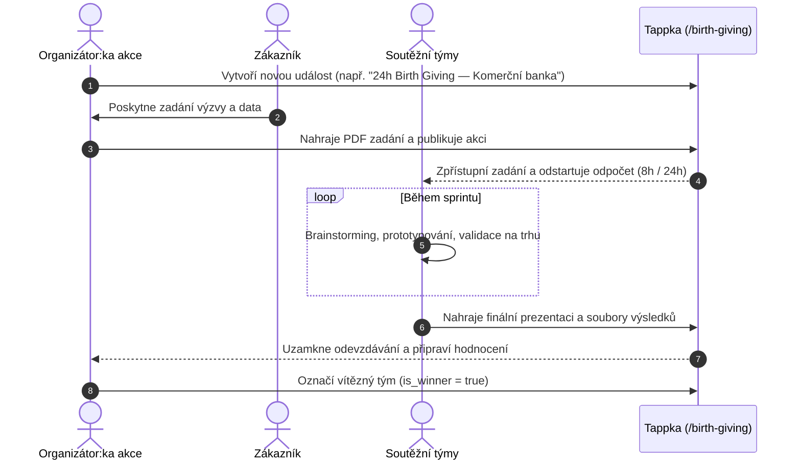

# Birth Giving (Inovační sprinty)

V metodice Tiimiakatemia je **Birth Giving** intenzivní inovační maraton (8hodinový nebo 24hodinový hackathon), během něhož studentské týmy pod časovým tlakem tvoří, validují a prezentují řešení konkrétní byznysové výzvy pro reálného zákazníka.

Modul **Birth Giving** (`/birth-giving`) zajišťuje kompletní organizaci těchto inovačních výzev, od zadání briefu přes odevzdání výstupů až po vyhlášení vítězů.

---

## 1. Průběh inovačního sprintu



---

## 2. Klíčové parametry akce

- **Délka sprintu (`duration`):** `8h` (jednodenní sprint) nebo `24h` (nonstop výzva přes noc).
- **Zákazník (`customer`):** Reálná firma nebo organizace, která platí zadání a posuzuje nápady.
- **Zadání (`assignment`):** Zabezpečený soubor v Supabase Storage (`birth-giving/assignments/...`), který se týmům odemkne až s oficiálním startem události.
- **Soutěžní týmy a výsledky (`birth_giving_teams`):**
  - Každý tým má svůj slot pro nahrání příloh (`result_files` v JSONB formátu).
  - Stav odevzdání: `pending`, `present`, `missing`.
  - Možnost odstoupení z vážných důvodů s evidencí důvodu (`cancelled_at`, `cancellation_reason`).
  - Maximálně jeden vítězný tým na událost (garantováno unikátním indexem `birth_giving_teams_event_winner_idx`).

---

## 3. Databázový model

Definováno v [`db/schema/birth-giving.ts`](https://github.com/spirit-of-tap/Tappka/blob/production/db/schema/birth-giving.ts):

```sql
create type birth_giving_duration as enum ('8h', '24h');
create type birth_giving_event_status as enum ('draft', 'published');
create type birth_giving_team_result_state as enum ('pending', 'present', 'missing');

-- Inovační událost
create table birth_giving_events (
  id uuid primary key default gen_random_uuid(),
  name text not null,
  customer text not null,
  starts_at timestamptz not null,
  duration birth_giving_duration not null,
  status birth_giving_event_status default 'draft' not null,
  organizer_profile_ids uuid[] not null,
  assignment_storage_path text,
  assignment_file_name text,
  created_at timestamptz default now() not null
);

-- Zapojené týmy a odevzdaná řešení
create table birth_giving_teams (
  id uuid primary key default gen_random_uuid(),
  event_id uuid references birth_giving_events(id) on delete cascade not null,
  name text not null,
  is_winner boolean default false not null,
  result_state birth_giving_team_result_state default 'pending' not null,
  result_files jsonb default '[]'::jsonb not null,
  cancelled_at timestamptz,
  cancellation_reason text
);

-- Pouze jeden vítěz na akci
create unique index birth_giving_teams_event_winner_idx 
  on birth_giving_teams (event_id) 
  where (is_winner and cancelled_at is null);
```

---

## 4. Cesty v aplikaci

- `/birth-giving` — Přehled běžících a archivních výzev.
- `/birth-giving/[id]` — Detail události, živý odpočet, stažení zadání a odevzdávací formulář pro tým.
