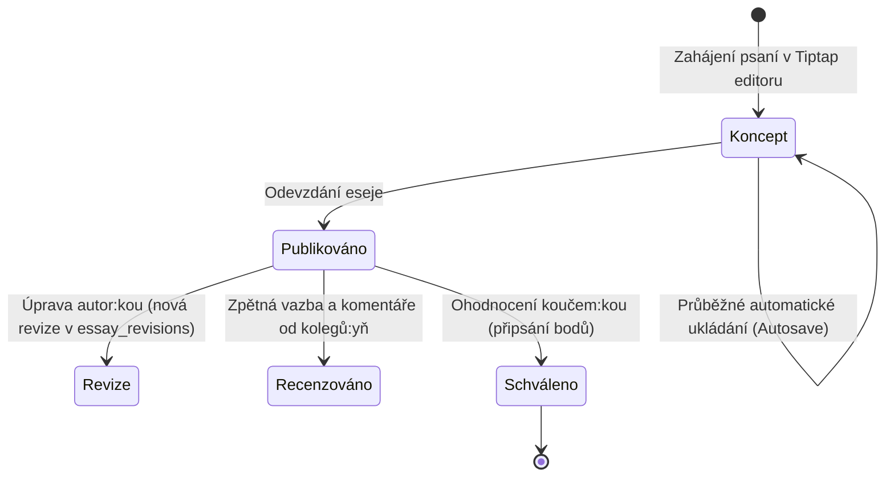

# Čtení a Eseje

Modul Čtení a Esejí tvoří jeden ze základních pilířů metodiky Tiimiakatemia. Studující během tříletého programu přečtou desítky knih z oblasti managementu, marketingu, leadershipu, psychologie a podnikání. Z každé přečtené publikace píší reflexní esej, v němž teorii propojují se zkušenostmi ze svých reálných týmových projektů.

---

## 1. Životní cyklus eseje



### 1.1 Koncept a Tiptap Editor
- Psaní eseje probíhá v plně integrovaném rich text editoru **Tiptap**.
- Podpora formátování: nadpisy, tučné písmo, kurzíva, odrážky, číslované seznamy, citace a zvýraznění.
- **Autosave konceptu:** Zabraňuje ztrátě rozepsané práce při výpadku spojení nebo zavření prohlížeče.

### 1.2 Odevzdání a zmrazení bodů (Frozen Book Points)
- V momentě publikace eseje systém vytvoří snapshot hodnoty knihy do sloupce `frozen_book_points` v tabulce `essays`.
- **Proč?** Pokud by se v budoucnu změnilo bodové ohodnocení knihy v katalogu (např. z 1.5 na 2.0 body), historicky schválené eseje studentů si zachovají přesně ten počet bodů, který platil v době odevzdání.

### 1.3 Alternativní zdroje (Content Sources)
- Kromě knih z katalogu mohou studující reflektovat také jiné vzdělávací zdroje: podcasty, odborné články, videa, konference či rozhovory.
- Tyto zdroje jsou evidovány v tabulce `content_sources` a v eseji jsou vzájemně exkluzivní s vazbou na knihu (`NOT (book_id IS NOT NULL AND content_source_id IS NOT NULL)`).

---

## 2. Bodový systém a katalog knih

Katalog knih eviduje stovky titulů s českými anotacemi, obálkami a štítky.

### Stavy knih v seznamu (`book_list_status`):
1. **Shortlist:** Prioritní, vysoce doporučená literatura schválená kouči.
2. **Longlist:** Širší doporučená četba rozšiřující specializace.
3. **Processing:** Nově navržená kniha čekající na posouzení a stanovení bodové hodnoty.
4. **Archived:** Vyřazené nebo zastaralé tituly.

### Výpočet a rozsah bodů:
- Hodnota knihy (`book_points`) se pohybuje v intervalu **0.25 až 3.00 bodu**.
- Zohledňuje počet stran (`page_count`), odbornou náročnost a aplikovatelnost pro týmové podnikání.

---

## 3. Komentáře a peer recenze

- Pod publikovaným esejem mohou ostatní studující i kouči zanechávat komentáře.
- Podpora pro reakce, úpravy vlastních komentářů a diskusní vlákna.
- E-mailové a in-app notifikace informují autora:ku o nové zpětné vazbě.

---

## 4. Databázový model

Schéma je definováno v [`db/schema/books.ts`](https://github.com/spirit-of-tap/Tappka/blob/production/db/schema/books.ts) a [`db/schema/essays.ts`](https://github.com/spirit-of-tap/Tappka/blob/production/db/schema/essays.ts):

```sql
-- Eseje
create table essays (
  id uuid primary key default gen_random_uuid(),
  author_profile_id uuid references profiles(id) on delete cascade not null,
  book_id uuid references books(id) on delete set null,
  content_source_id uuid references content_sources(id) on delete set null,
  frozen_book_points numeric(3, 2) check (frozen_book_points between 0 and 3),
  published_at timestamptz,
  pinned_at timestamptz,
  created_at timestamptz default now() not null
);

-- Historie revizí obsahu eseje
create table essay_revisions (
  essay_id uuid references essays(id) on delete cascade not null,
  revision_no integer not null,
  title text not null,
  content jsonb not null, -- Tiptap JSON dokument
  word_count integer not null,
  created_at timestamptz default now() not null,
  primary key (essay_id, revision_no)
);

-- Komentáře a zpětná vazba
create table essay_comments (
  id uuid primary key default gen_random_uuid(),
  essay_id uuid references essays(id) on delete cascade not null,
  author_profile_id uuid references profiles(id) on delete cascade not null,
  content text not null,
  parent_id uuid references essay_comments(id) on delete cascade,
  created_at timestamptz default now() not null
);
```

---

## 5. Cesty v aplikaci

- `/cteni` — Přehled četby, semestrální cíl, odevzdané eseje a rozepsané koncepty.
- `/cteni/knihy` — Vyhledávání v katalogu knih, filtrace podle tagů a bodů.
- `/cteni/knihy/[id]` — Detail knihy s anotací, seznamem fyzických kopií a napsaných esejů.
- `/eseje/novy` — Editor pro psaní nového eseje.
- `/eseje/[id]` — Čtení eseje, revize a diskusní vlákno.
