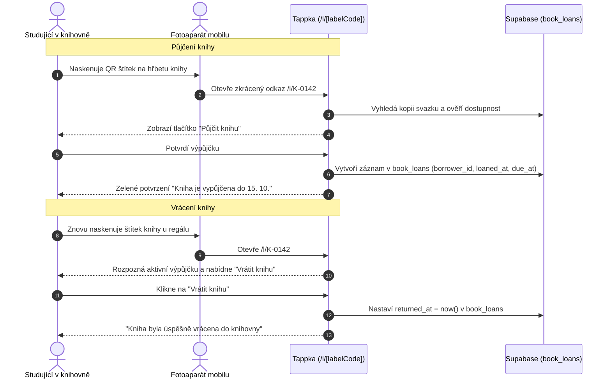

# Fyzická knihovna a správa výpůjček

Kromě digitální evidence literatury disponuje Tiimiakatemia Prague vlastní fyzickou knihovnou přímo v prostorách kampusu. 

Modul **Knihovna** propojuje reálné papírové svazky s digitálním systémem pomocí QR štítků a čárových kódů, což umožňuje samoobslužné půjčování a vracení knih během několika sekund.

---

## 1. Hlavní procesy



---

## 2. QR štítky a zkrácená URL (`/l/[labelCode]`)

Každý fyzický svazek má na sobě nalepený odolný štítek s QR kódem.
- **Kód štítku:** Alfanumerický kód formátu `TAP-XXXX` nebo `K-XXXX` parsovaný pomocí [`src/lib/library/label-code.ts`](https://github.com/spirit-of-tap/Tappka/blob/production/src/lib/library/label-code.ts).
- **Zkrácená trasa (`src/app/l/[labelCode]/page.tsx`):**
  - Po naskenování fotoaparátem telefon otevře např. `https://tiimi.cz/l/0142`.
  - Pokud svazek existuje, přesměruje uživatele přímo na stránku detailu knihy s předvyplněným štítkem (`/cteni/knihy/[id]/pujcit?label=0142`).
  - Pokud štítek ještě není v databázi spárován a uživatel je kouč:ka nebo administrátor:ka, je přesměrován do rozhraní pro spárování nového svazku (`/knihovna/stitky?label=0142`).

### Hromadné generování štítků pro tisk
Projekt obsahuje skript pro hromadný export tiskových etiket s QR kódy:
```bash
pnpm library:qr-labels
```
Skript vygeneruje tiskové PDF/vektory s logem TAP a QR kódy připravené pro nalepení na nové knihy.

---

## 3. Databázový model

Výpůjčky a kopie jsou definovány v [`db/schema/books.ts`](https://github.com/spirit-of-tap/Tappka/blob/production/db/schema/books.ts):

```sql
-- Fyzické svazky na kampusu
create table library_books (
  id uuid primary key default gen_random_uuid(),
  book_id uuid references books(id) on delete cascade not null,
  label_code text unique,              -- např. '0142'
  condition text default 'good',       -- 'new', 'good', 'worn', 'damaged'
  notes text,
  created_at timestamptz default now() not null
);

-- Historie a aktivní výpůjčky
create table book_loans (
  id uuid primary key default gen_random_uuid(),
  library_book_id uuid references library_books(id) on delete cascade not null,
  borrower_profile_id uuid references profiles(id) on delete cascade not null,
  loaned_at timestamptz default now() not null,
  due_at timestamptz not null,
  returned_at timestamptz,
  created_at timestamptz default now() not null
);
```

### Stavy a kalkulace dostupnosti:
- **Dostupná kopie (`availableCopies`):** Počet svazků dané knihy v `library_books`, které nemají aktivní záznam v `book_loans` s `returned_at IS NULL`.
- **Zpožděná výpůjčka (`isOverdue`):** Výpůjčka, kde `returned_at IS NULL` a současně `now() > due_at`. Uživatel obdrží připomínku k vrácení.

---

## 4. Cesty v aplikaci

- `/knihovna` — Přehled fyzické knihovny, aktuálně půjčené knihy přihlášeného studenta a celková statistika regálů.
- `/knihovna/skenovat` — Mobilní rozhraní s přístupem ke kameře pro bleskové skenování čárových kódů (ISBN) a QR kódů štítků.
- `/knihovna/stitky` — Administrátorské rozhraní pro přiřazování nových QR kódů k fyzickým knihám.
- `/l/[labelCode]` — Rychlá URL zkratka pro QR čtečky.
