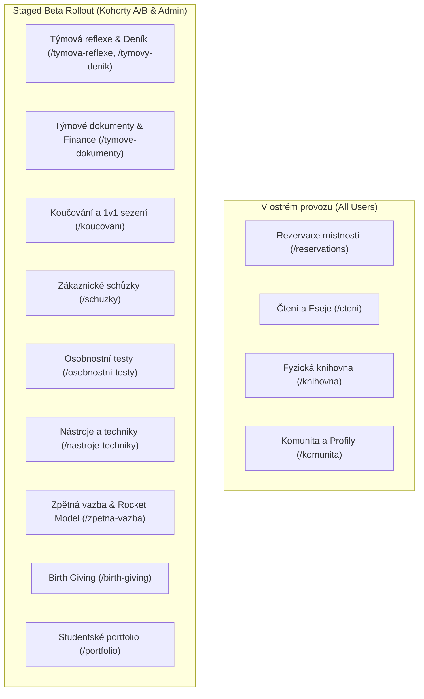

# Přehled modulů Tappka

Tappka je modulární platforma navržená na míru potřebám vysokoškolského programu Tiimiakatemia. 

Jednotlivé moduly pokrývají celý životní cyklus týmového podnikání studentů: od zrození týmu (Birth Giving), přes každodenní provoz v kampusu a čtení literatury, až po finanční řízení, klientské schůzky a závěrečné kompetenční portfolio.

---

## 1. Stav nasazení modulů (Status Map)

Moduly jsou rozděleny na **Plně produkční** (v každodenním používání všemi ročníky) a **Ve vývoji / Beta rollout** (přístupné pro vybrané kohorty a administrátory).

---

## 2. Katalog všech modulů

| Modul | Primární cesty | Cíl a metodický význam | Stav |
| :--- | :--- | :--- | :--- |
| [**Rezervace místností**](/modules/reservations) | `/reservations`, `/rezervace`, `/r/[code]` | Přehled a rezervace týmových prostor v kampusu, detekce konfliktů, NFC/QR kódy na dveřích | Produkce |
| [**Čtení a Eseje**](/modules/cteni-a-eseje) | `/cteni`, `/eseje` | Evidence přečtených knih, systém bodů za četbu, psaní a recenzování esejů, schvalování kouči:kami | Produkce |
| [**Fyzická knihovna**](/modules/knihovna) | `/knihovna`, `/l/[code]` | Správa fyzických svazků na kampusu, čtečka čárových kódů, QR štítky výpůjček a vracení | Produkce |
| [**Komunita a Profily**](/modules/komunita-a-profily) | `/komunita`, `/profil/[id]` | Adresář studentů, koučů a týmů, profily členů, vyhledávání a týmové sestavy | Produkce |
| [**Týmová reflexe & Deník**](/modules/tymova-reflexe-a-denik) | `/tymova-reflexe`, `/tymovy-denik` | 9měsíční reflexní cyklus, záznamy z Training Sessions, semestrální bilance a týmový deník | Beta (B) |
| [**Týmové dokumenty & Finance**](/modules/tymove-dokumenty) | `/tymove-dokumenty` | Týmová smlouva, vedoucí myšlenky, finanční směrnice, rozvaha, výsledovka a zprávy | Beta (B) |
| [**Koučování**](/modules/koucovani) | `/koucovani` | Plánování 1v1 a týmových koučovacích sezení, záznamy, akční kroky a cíle | Beta (B) |
| [**Zákaznické schůzky**](/modules/zakaznicke-schuzky) | `/schuzky` | Evidence obchodních schůzek se zákazníky, prodejní pipeline, generovaný obrat projektů | Beta (B) |
| [**Osobnostní testy**](/modules/osobnostni-testy) | `/osobnostni-testy` | Diagnostika Belbinových týmových rolí a MBTI profilů pro efektivní skládání týmů | Beta (B) |
| [**Nástroje a Techniky**](/modules/nastroje-a-techniky) | `/nastroje-techniky` | Knihovna metodik, workshopových technik, myšlenkových map a podnikatelských šablon | Beta (B) |
| [**Zpětná vazba**](/modules/zpetna-vazba) | `/zpetna-vazba` | Vzájemná 360° zpětná vazba a vyhodnocování týmu dle metodiky Rocket Model | Beta (B) |
| [**Birth Giving**](/modules/birth-giving) | `/birth-giving` | Rituály a záznamy ze zrození nových týmových projektů a společností | Beta (B) |
| [**Studentské Portfolio**](/modules/portfolio) | `/portfolio`, `/wiki` | Celková rekapitulace studijních milníků, kreditů a kompetencí pro obhajobu titulu | Beta (B) |

---

## 3. Společné prvky všech modulů

Všechny moduly v aplikaci sdílejí jednotné architektonické standardy:
1. **Jednotný vizuální rámec:** Používají `<PageShell>` a `<PageHeader>` se synchronizovaným počítadlem záznamů přes `pluralizeCz` a drobečkovou navigací zpět.
2. **Přístupová práva:** Před načtením dat server ověří uživatelův profil v `getSessionProfile()`. V případě beta modulů volá `canAccessFeature(profile, featureName)`.
3. **Globální vyhledávání (Spotlight):** Každý modul registruje své hlavní entity do Spotlight command palety (`Cmd+K`), takže uživatel:ka může odkudkoliv skočit rovnou na knihu, místnost nebo schůzku.
