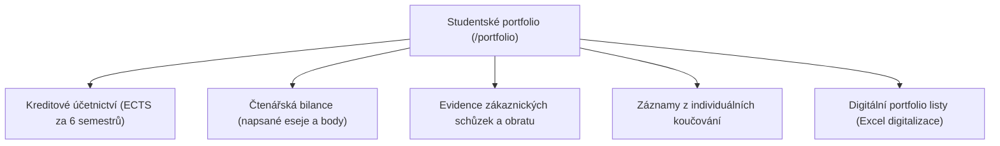

# Studentské portfolio a digitalizace

Závěrečným výstupem tříletého studia v Tiimiakatemia je komplexní **Studentské portfolio** a obhajoba dosažených kompetencí před akademickou i podnikatelskou komisí.

Modul **Portfolio** (`/portfolio`) a související [Portfolio Wiki](/portfolio-sheets) slouží jako jednotné centrum všech akademických podkladů, kreditového účetnictví a digitálních listů (sheets).

---

## 1. Struktura portfolia

Portfolio studenta integruje data ze všech modulů Tappky do jednoho přehledu:

---

## 2. Digitalizace portfoliových listů (Sheets)

Historicky studenti odevzdávali rozsáhlé excelové sešity (`individualni.xlsx` a `tymovy.xlsx`). Tappka tyto tabulky plně nahrazuje interaktivními webovými rozhraními a vizuálními reporty:

### Přehled digitalizovaných listů:

#### Individuální listy (Individual Sheets):
1. **Přehled týmu a týmová společnost:** Zakládající informace a složení.
2. **Training Session (TS):** Docházka a zapojení do týmových dialogů.
3. **Team Contract & Leading Thoughts:** Dodržování týmových hodnot.
4. **Týmové role:** Rozdělení odpovědností (CEO, Finanční ředitel, Marketing, ...).
5. **Týmový deník:** Aktivní účast na životě firmy.
6. **Měsíční a semestrální reflexe:** Kontinuální učení.
7. **Rocket Model:** Individuální vnímání týmové dynamiky.
8. **Týmová zpětná vazba:** Hodnocení kolegů a kolegyň.
9. **Finanční směrnice a výkazy:** Rozvaha, VZZ a výroční zpráva společnosti.
10. **Zpráva k bakalářské/závěrečné práci (TP):** Syntéza teorie a vlastní praxe.

#### Týmové listy (Team Sheets):
- Projekty, Zákaznické schůzky, Nástroje a techniky, Cross-fertilizace, Skill Profile, Learning Contract, Individuální koučování, Birth Giving, Osobnostní testy a Odborná praxe.

---

## 3. Prohlížení a validace

- Vizuální archiv všech šablon je dostupný na [Vizuální přehled listů](/portfolio-sheets) a v [Portfolio Wiki](/wiki).
- Výsledné portfolio je možné exportovat jako ucelený souhrn pro akreditační komisi a obhajobu.

---

## 4. Cesty v aplikaci

- `/portfolio` — Hlavní kontrolní panel studenta s přehledem kreditů a chybějících milníků.
- `/portfolio/sheets` — Přehled vyplněných digitálních listů za jednotlivé semestry.
- `/portfolio-sheets` — Vizuální rozcestník HTML šablon v interní dokumentaci.
