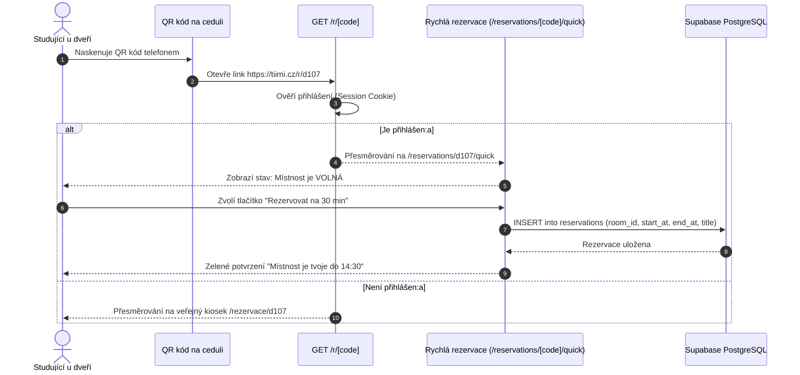

# Rezervace místností

Modul rezervací spravuje sdílené týmové kanceláře, zasedací místnosti a workshopové prostory na kampusu Tiimiakatemia Prague (ČZU PEF).

Je navržen tak, aby eliminoval konflikty v rozvrhu, umožňoval jak dlouhodobé plánování, tak okamžitou ad-hoc rezervaci při příchodu do místnosti přes QR / NFC kód na dveřích.

---

## 1. Hlavní funkce a možnosti

1. **Časová osa a přehled dne:**
   - Zobrazení vytížení všech místností kampusu v čase od **7:00 do 22:00** (`OPERATING_HOURS`).
   - Časové sloty jsou děleny po **15 minutách** (`TIME_SLOT_MINUTES = 15`).
   - Přepínání mezi denním pohledem, týdenním kalendářem a seznamem podle místností.
2. **Typy rezervací (Reservation Kinds):**
   - **Osobní rezervace (`personal`):** Schůzky projektových týmů, samostatná práce, klientská jednání.
   - **Training Sessions (`training_session`):** Pravidelné celotýmové dialogy a tréninky týmů (automaticky prefixováno `TS - [Název týmu]`).
   - **Houston Calling (`houston_calling`):** Pravidelná celoškolní setkání a synchronizace všech ročníků a koučů.
3. **Pravidelné rozvrhy a výluky:**
   - Podpora pro semestrální opakující se bloky (`recurring_schedules`).
   - Správa prázdnin a svátků (`schedule_breaks`), během nichž jsou pravidelné rozvrhy pozastaveny.
4. **Dveřní cedule a okamžité rezervace (Door Posters):**
   - Každá místnost má u vstupu fyzickou ceduli s NFC čipem a QR kódem směřujícím na zkrácenou URL `/r/[code]` (např. `/r/d107`).
   - **Přihlášený uživatel:** Okamžité přesměrování na `/reservations/[code]/quick`, kde může jedním kliknutím zabrat místnost na 15, 30 nebo 60 minut.
   - **Nepřihlášený návštěvník / tablet:** Zobrazení veřejného kioskového režimu na `/rezervace/[code]` s aktuálním stavem (Volno / Obsazeno) a nejbližším programem.

---

## 2. Tok okamžité rezervace u dveří



---

## 3. Detekce konfliktů a validace

Před vytvořením každé rezervace serverová validace v [`src/lib/reservations/utils.ts`](https://github.com/spirit-of-tap/Tappka/blob/production/src/lib/reservations/utils.ts) ověřuje následující pravidla:
1. **Překryv intervalů:** Rezervace se nesmí překrývat s žádnou existující rezervací stejné místnosti:
   $$\text{nová.start} < \text{stávající.end} \quad \land \quad \text{nová.end} > \text{stávající.start}$$
2. **Provozní doba:** Počátek i konec musí spadat do intervalu 7:00 až 22:00.
3. **Kapacita místnosti:** Počet osob nesmí překročit maximální povolenou kapacitu dané místnosti.
4. **Vlastnictví rezervace:** Uživatelskou rezervaci může upravit nebo smazat pouze její autor:ka nebo administrátor:ka. Training Sessions a Houston Calling spravuje vedení školy.

---

## 4. Databázové schéma

Tabulky modulu jsou definovány v [`db/schema/reservations.ts`](https://github.com/spirit-of-tap/Tappka/blob/production/db/schema/reservations.ts):

```sql
-- Místnosti kampusu
create table rooms (
  id uuid primary key default gen_random_uuid(),
  code text unique not null,         -- např. 'd107', 'd126'
  name text not null,                 -- např. 'Akropolis', 'Oáza'
  capacity integer not null default 10,
  floor integer not null default 1,
  equipment text[],                   -- např. {'projector', 'whiteboard'}
  is_active boolean not null default true
);

-- Jednotlivé rezervace
create table reservations (
  id uuid primary key default gen_random_uuid(),
  room_id uuid references rooms(id) on delete cascade not null,
  user_id uuid references profiles(id) on delete cascade not null,
  title text not null,
  person_count integer not null default 1,
  start_at timestamptz not null,
  end_at timestamptz not null,
  created_at timestamptz default now() not null
);

-- Opakující se semestrální harmonogramy (Training Sessions, Houston Calling)
create table recurring_schedules (
  id uuid primary key default gen_random_uuid(),
  room_id uuid references rooms(id) on delete cascade not null,
  schedule_type schedule_type not null, -- 'training_session' | 'houston_calling'
  team_id uuid references teams(id),
  day_of_week integer not null,         -- 0 (neděle) až 6 (sobota)
  start_time time not null,
  end_time time not null,
  valid_from date not null,
  valid_until date not null
);

-- Výluky rozvrhu (prázdniny, státní svátky)
create table schedule_breaks (
  id uuid primary key default gen_random_uuid(),
  name text not null,
  start_date date not null,
  end_date date not null
);
```

---

## 5. Cesty a komponenty v aplikaci

| Cesta | Účel | Soubor |
| :--- | :--- | :--- |
| `/reservations` | Hlavní přehled místností a kalendář pro přihlášené | `src/app/(main)/reservations/page.tsx` |
| `/reservations/[code]/quick` | Rychlá mobilní rezervace po naskenování QR kódu | `src/app/(main)/reservations/[code]/quick/page.tsx` |
| `/rezervace/[code]` | Veřejný náhled místnosti pro návštěvy a tablety | `src/app/rezervace/[code]/page.tsx` |
| `/r/[code]` | Zkracovací přesměrovací endpoint pro fyzické štítky | `src/app/r/[code]/route.ts` |
