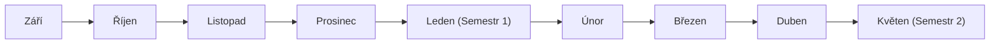

# Týmová reflexe a Týmový deník

Týmové učení stojí v Tiimiakatemia na neustálém cyklu akce, reflexe a aplikace nových poznatků. Týmy se nescházejí jen proto, aby pracovaly, ale aby vědomě reflektovaly své úspěchy, nezdary, týmovou dynamiku a plnění cílů.

Tento modul pokrývá dva úzce provázané nástroje: **Měsíční a semestrální reflexe** (`/tymova-reflexe`) a **Týmový deník** (`/tymovy-denik`).

---

## 1. Měsíční reflexní cyklus (9měsíční kalendář)

Akademický rok na Tiimiakatemia je rozdělen do 9 měsíců (září až květen/červen). Modul vizualizuje stav týmových reflexí v interaktivní mřížce měsíců:



### Struktura měsíční reflexe:
Měsíční reflexe odpovídá na 4 základní otázky zkušenostního učení:
1. **Co se nám povedlo? (`what_went_well`)** — Úspěchy projektů, uzavřené obchody, zvládnuté výzvy.
2. **Co se nám nepovedlo? (`what_didnt_go_well`)** — Selhání komunikace, nedodržené termíny, finanční ztráty.
3. **Co příště uděláme jinak? (`what_we_do_differently`)** — Konkrétní ponaučení a změna procesů.
4. **Akční kroky (`team_reflection_action_steps`)** — Konkrétní úkoly s přiřazenou zodpovědnou osobou a termínem.

---

## 2. Semestrální a výroční reflexe (`team_annual_reflections`)

Na konci každého semestru provádí tým hlubší syntézu:
- Zhodnocení naplnění Týmové smlouvy (Team Contract).
- Vyhodnocení obratu a zisku společnosti za uplynulý půlrok.
- Revize cílů a stanovení priorit na další období.

---

## 3. Týmový deník (`/tymovy-denik`)

Týmový deník slouží jako společný digitální záznamník společnosti.
- **Záznamy z Training Sessions (TS):** Každý týden probíhají dva čtyřhodinové tréninky. V deníku se zaznamenávají hlavní témata dialogu, rozhodnutí a úkoly.
- **Milníky projektů:** Start nového projektu, podpis smlouvy s klientem, expedice zakázky.
- **Fulltextové vyhledávání:** Kdykoliv se tým může vrátit k rozhodnutím učiněným před několika měsíci.

---

## 4. Databázový model

Definováno v [`db/schema/team-reflections.ts`](https://github.com/spirit-of-tap/Tappka/blob/production/db/schema/team-reflections.ts) a [`db/schema/team-activities.ts`](https://github.com/spirit-of-tap/Tappka/blob/production/db/schema/team-activities.ts):

```sql
-- Měsíční reflexe
create table team_reflections (
  id uuid primary key default gen_random_uuid(),
  team_id uuid references teams(id) on delete cascade not null,
  month date not null,
  what_went_well text,
  what_didnt_go_well text,
  what_we_do_differently text,
  responsible_person text,
  created_at timestamptz default now() not null,
  unique (team_id, month) where (removed_at is null)
);

-- Konkrétní akční kroky z reflexe
create table team_reflection_action_steps (
  id uuid primary key default gen_random_uuid(),
  team_reflection_id uuid references team_reflections(id) on delete cascade not null,
  description text not null,
  assignee_profile_id uuid references profiles(id),
  custom_assignee text,
  order_index integer default 0 not null
);

-- Týmové aktivity a deník
create table team_activities (
  id uuid primary key default gen_random_uuid(),
  team_id uuid references teams(id) on delete cascade not null,
  title text not null,
  content text not null,
  activity_type text not null, -- 'training_session', 'milestone', 'meeting'
  activity_date timestamptz not null default now(),
  created_by_profile_id uuid references profiles(id) not null
);
```

### Zabezpečení dat:
- Zápis a čtení jsou přes RLS omezeny pouze na aktivní členy daného týmu (`team_id = current_profile.team_id`) a jejich kouče:ku. Cizí týmy nemají k interním reflexím přístup.

---

## 5. Cesty v aplikaci

- `/tymova-reflexe` — Přehled kalendáře reflexí pro tým přihlášeného uživatele.
- `/tymova-reflexe/[id]` — Detail a editor konkrétní měsíční reflexe.
- `/tymova-reflexe/semestralni/[id]` — Vyhodnocení semestrální bilance.
- `/tymovy-denik` — Časová osa deníku týmu, filtrování podle typů aktivit a vkládání nových záznamů.
