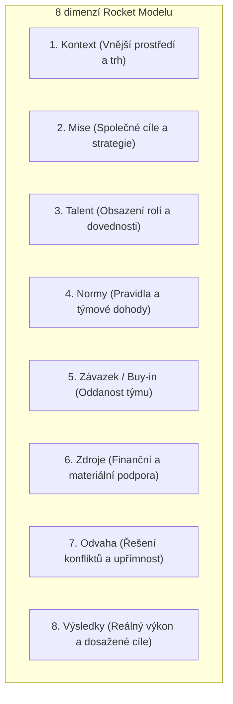

# Zpětná vazba a Rocket Model

Kvalitní a otevřená zpětná vazba je základem psychologického bezpečí a vysokého výkonu v týmech Tiimiakatemia. 

Tento modul pokrývá dvě oblasti:
1. **Metodické hodnocení týmu dle rámce Rocket Model** (hodnocení dynamiky týmu v 8 dimenzích).
2. **Systém průběžné zpětné vazby k aplikaci a provozu kampusu** (`/zpetna-vazba`).

---

## 1. Rocket Model v týmové praxi

Rocket Model je diagnostický a rozvojový rámec vytvořený Gordonem Curphyem a Robertem Hoganem, který Tiimiakatemia využívá pro pravidelný audit zdraví týmových společností.



Studující pravidelně hodnotí svůj tým ve všech 8 oblastech (na škále 1–5), což vytváří týmový radarový graf. Slabá místa (často *Normy* nebo *Odvaha* v prvním ročníku) se stávají přímým tématem pro nejbližší Training Session nebo koučování.

---

## 2. Průběžná zpětná vazba k platformě (`/zpetna-vazba`)

Pro udržení kultury neustálého zlepšování mohou studující i pedagogové kdykoliv poslat podnět, nahlásit chybu nebo navrhnout vylepšení přímo v rozhraní.

### Databázový model:
Definováno v [`db/schema/feedback.ts`](https://github.com/spirit-of-tap/Tappka/blob/production/db/schema/feedback.ts):

```sql
create table feedback (
  id uuid primary key default gen_random_uuid(),
  author_profile_id uuid references profiles(id) on delete cascade not null,
  body text not null check (char_length(body) between 1 and 4000),
  resolved_at timestamptz,             -- Datum vyřešení administrátory
  created_at timestamptz default now() not null,
  updated_at timestamptz default now() not null,
  created_by_profile_id uuid references profiles(id) not null,
  updated_by_profile_id uuid references profiles(id) not null
);
```

### Tok zpracování:
1. Uživatel:ka odešle zpětnou vazbu z patičky nebo dialogu.
2. Zpětná vazba se zobrazí administrátorům v přehledu otevřených ticketů.
3. Po zapracování úpravy označí administrátor:ka podnět jako vyřešený (`resolved_at = now()`).

---

## 3. Cesty v aplikaci

- `/zpetna-vazba` — Seznam podnětů, formulář pro vložení nové zpětné vazby.
