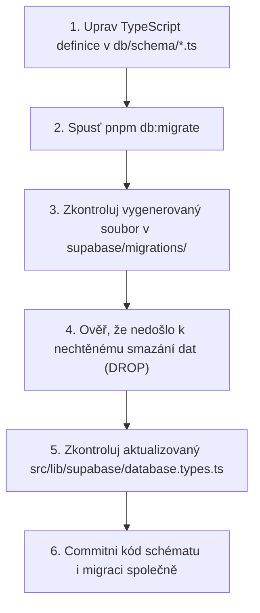

# Databázové migrace a správa schématu

Tento dokument je závazným průvodcem pro jakékoliv změny databázového schématu, tabulek, sloupců, indexů, triggerů a RLS politik v projektu Tappka.

---

## 1. Zlatá pravidla

> [!IMPORTANT]
> **Jediným zdrojem pravdy pro schéma jsou soubory `db/schema/*.ts` (Drizzle ORM).**
> - **NIKDY nepis ručně SQL migrace** pro tvorbu či úpravu tabulek, sloupců, enumů a RLS politik.
> - **Vždy zapínej Row Level Security (RLS)** na každé nové tabulce (`.enableRLS()`).
> - **Vždy zkontroluj vygenerovanou migraci na případné nechtěné DROP COLUMN / DROP TABLE** před jejím aplikováním do sdíleného prostředí.
> - **V aplikačním kódu nikdy nepoužívej runtime Drizzle klienta** — data se dotazují výhradně přes `@supabase/supabase-js` pod přihlášeným uživatelem.

---

## 2. Standardní postup: Změna schématu (Tabulky, Sloupce, RLS)



### Podrobný postup:
1. **Editace schématu:** Otevři příslušný soubor v `db/schema/` (např. `db/schema/books.ts`) a přidej sloupec nebo uprav typ.
2. **Generování a aplikace:**
   ```bash
   pnpm db:migrate
   ```
   *Tento příkaz automaticky provede celou sekvenci:*
   - `db:generate`: Porovná stav `db/schema/*.ts` s Drizzle deníkem a vygeneruje nový `.sql` soubor do `supabase/migrations/`.
   - `supabase:start`: Zajistí běh lokálního PostgreSQL kontejneru.
   - `db:up`: Aplikuje novou migraci přes Supabase CLI.
   - `db:types`: Přegeneruje TypeScript typy do `src/lib/supabase/database.types.ts`.
   - `db:export`: Exportuje aktuální schéma do `supabase/schema.sql`.

3. **Kontrola případných DROPů:** Otevři vygenerovaný soubor v `supabase/migrations/XXXXX_name.sql` a ujisti se, že neobsahuje nechtěný `DROP COLUMN` nebo `DROP TABLE`.

---

## 3. PostgreSQL funkce a triggery

Drizzle ORM neumí plně deklarativně modelovat komplexní PostgreSQL funkce a triggery. Pro tyto případy platí specializovaný postup:

1. **Vygeneruj prázdnou migraci:**
   ```bash
   pnpm db:generate:custom
   ```
2. **Zapiš SQL:** Otevři nově vytvořený soubor v `supabase/migrations/` a napiš idempotetní SQL příkaz (`CREATE OR REPLACE FUNCTION ...`, `CREATE TRIGGER ...`).
3. **Aplikuj migraci:**
   ```bash
   pnpm db:up
   ```
4. **Zaznamenej do Drizzle deníku:**
   Spusť jednou `pnpm db:generate` (ohlásí *"No schema changes"*), aby Drizzle meta-journal zaznamenal existenci migrace.
5. **Aktualizuj typy a export:**
   ```bash
   pnpm db:types && pnpm db:export
   ```

---

## 4. Diagnostika a kontrola integrity (`db:doctor`)

Před vytvořením Pull Requestu vždy ověř, že tvoje schéma netrpí driftem:

```bash
pnpm db:doctor
```

Tento příkaz spustí:
- `pnpm db:check-integrity` — ověří hash souborů a pořadí migrací.
- `pnpm db:local-check` — ověří, zda lokální databáze přesně odpovídá Drizzle schématu.

---

## 5. Práce s odvozenými typy v aplikaci

Nikdy nepiš typy řádků ručně. Vždy je odvozuj z databázových definic:

```typescript
import type { Tables } from '@/lib/supabase/tables';
import type { Database } from '@/lib/supabase/database.types';

// Správně: typ řádku odvozený přímo z vygenerovaného schématu
export type Room = Tables<'rooms'>;
export type Reservation = Tables<'reservations'>;
export type ProfileRole = Database['public']['Enums']['profile_role'];
```
Tím je zaručeno, že při jakékoliv změně v databázi TypeScript okamžitě odhalí nekompatibilní místa v kódu už při překladu (`pnpm typecheck`).
