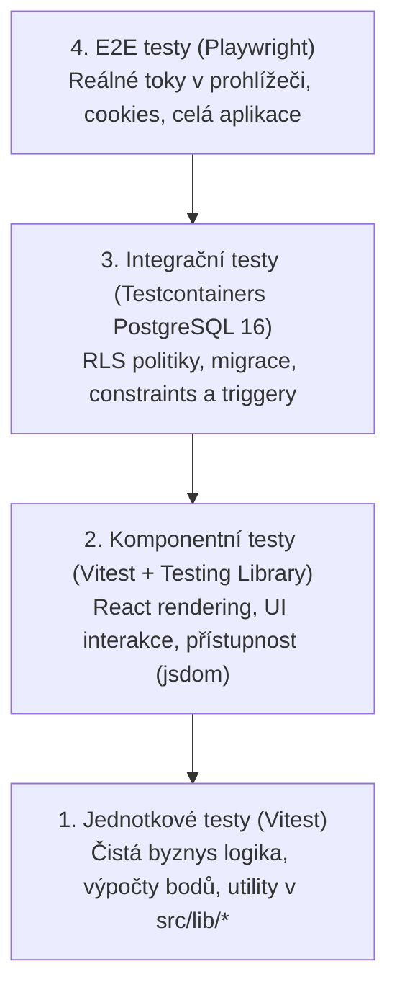

# Testovací strategie a spouštění testů

Testování v Tappce je rozděleno do čtyř doplňujících se vrstev. Všechny testy lze spouštět přímo pomocí balíčkovacího správce `pnpm`.

---

## 1. Čtyři testovací vrstvy



### Přehled spouštění

| Vrstva | Příkaz | Požadavky | Co přesně testuje |
| :--- | :--- | :--- | :--- |
| **Jednotková (Unit)** | `pnpm test:unit` | žádné | Čistou logiku v `src/lib/*` (testy `*.test.ts` přímo u zdrojáků) |
| **Komponentní** | `pnpm test:component` | žádné | React komponenty přes jsdom a Testing Library (`*.test.tsx`) |
| **Integrační** | `pnpm test:integration` | Docker | Databázové schéma, triggery a RLS v izolovaném kontejneru (`tests/integration/*.int.test.ts`) |
| **End-to-End (E2E)** | `pnpm test:e2e` | Lokální Supabase + build | Kritické uživatelské toky v reálném prohlížeči (`tests/e2e/*.spec.ts`) |

::: code-group
```bash [Běžný test (Unit + Komponenty)]
# Rychlý běh bez potřeby Dockeru (součást rychlého cyklu před commitem)
pnpm test
```

```bash [Watch režim]
# Automatické přetestování při úpravě souborů
pnpm test:watch
```

```bash [Integrační testy DB]
# Spustí Testcontainers PostgreSQL kontejner a otestuje RLS
pnpm test:integration
```

```bash [E2E testy]
# Spustí Playwright testy proti běžící aplikaci
pnpm test:e2e
```
:::

---

## 2. Integrační databáze (Testcontainers)

Integrační testy startují **zcela izolovaný, jednorázový** kontejner `postgres:16` přes knihovnu Testcontainers.
Při startu spustí skript `tests/setup/bootstrap.sql`, který vytvoří minimální povrch objektů spravovaných Supabase (`auth`, `realtime`, `storage`), a poté aplikuje všechny migrace ze složky `supabase/migrations`.

> [!IMPORTANT]
> **Tvoje lokální vývojová databáze se při testech nijak nemění ani nerestartuje.** Testy se připojují výhradně k dočasnému kontejneru, který se po dokončení testů automaticky smaže.

- **Vždy rollback:** Každý jednotlivý test běží uvnitř funkce `withRollback()` (`tests/setup/tx.ts`) — transakce je na konci testu vždy vrácena zpět, takže v databázi nezůstávají žádná data z předchozích běhů.
- **Testování RLS politik:** Pomocí helperů `asClaims(client, { sub: userId })` nebo `asAnon(client)` (`tests/setup/rls.ts`) můžeš přímo testovat, co konkrétní uživatel:ka smí a nesmí číst nebo zapisovat.
- **Vytváření testovacích dat:** Pro generování záznamů v testech používej továrny v `tests/setup/factories.ts`.

Pokud nová migrace odkazuje na objekt spravovaný Supabase, který integrační shim postrádá, setup selže s chybou `Migration failed: <soubor>`. V takovém případě doplň minimální chybějící objekt do `tests/setup/bootstrap.sql`. **Nikdy neupravuj existující soubory v `supabase/migrations/` kvůli testům.**

---

## 3. Autentizované E2E toky (Playwright)

Základní E2E testy ověřují veřejně dostupné cesty a přihlašovací obrazovku (protože externí Google OAuth nelze plnohodnotně automatizovat v CI).

Pro testování toků vyžadujících přihlášení:
1. Vytvoř seedovaného testovacího uživatele:uživatelku.
2. Vygeneruj session token pomocí klíče `service_role` přes administrátorské API Supabase.
3. Vlož session cookie do kontextu prohlížeče v Playwright fixture.
4. Spusť požadovaný testovací scénář.
