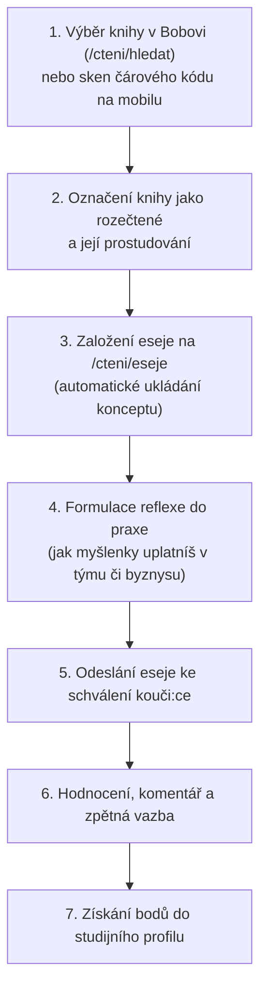

# Uživatelský průvodce: Čtení, Kniha knih (Bob) a Eseje

Čtení odborné literatury a psaní reflexních esejů tvoří základní pilíř metodiky Tiimiakatemia Prague. Nejde o samoúčelné biflování teorie ani o pasivní referáty ze střední školy — cílem je přenést poznatky z knih přímo do chodu tvé týmové firmy, do reálných projektů a do osobního rozvoje.

V Tappce najdeš ucelený systém pro práci s literaturou: kurátorský katalog **Bob**, evidenci ročních čtenářských cílů, psaní esejů s průběžným ukládáním a systém zpětné vazby od tvého kouče:ky.

---

## Jak probíhá proces od výběru knihy po získání bodů

---

## Kniha knih (Bob) — Oficiální katalog literatury

V komunitě Tiimiakatemia se oficiálnímu seznamu kanonické i doporučené literatury přezdívá **Bob** (z anglického *Book of Books*, Kniha knih). Tento katalog obsahuje prověřené tituly z klíčových oblastí podnikání, marketingu, vedení týmů, psychologie, inovací a financí.

Katalog najdeš v aplikaci na adrese `/cteni/hledat` nebo přes horní navigaci **Čtení -> Hledat knihy**.

### Kde a jak hledat knihy v Bobovi
1. **Fulltextové vyhledávání:** Do vyhledávacího pole můžeš zadat název titulu, jméno autora:ky, téma nebo klíčové slovo.
2. **Kategoriální filtry:** Knihy můžeš filtrovat podle zaměření (např. *Leadership & Vedení lidí*, *Prodej & Zákazníci*, *Týmová spolupráce*, *Finance & Právo*, *Osobní produktivita*).
3. **Mobilní skener čárových kódů (ISBN):** Pokud držíš knihu v ruce (např. v kampusu nebo v knihkupectví), klepni v mobilním rozhraní na ikonu fotoaparátu. Namiř objektiv na ISBN čárový kód na zadní straně knihy a Tappka titul okamžitě vyhledá v katalogu.

---

## Jak poznat schválenou literaturu a stavy knih

Aby byla esej uznána a připsány ti za ni body, musí být kniha schválena jako odborná literatura odpovídající úrovni vysokoškolského studia v Tiimiakatemia.

Každá kniha v katalogu má přiřazen jeden ze čtyř oficiálních stavů schválení:

| Stav knihy | Vizuální označení | Význam a pravidla pro esej |
| :--- | :--- | :--- |
| **Shortlist (Ověřená kniha)** | Modrá fajfka (`BadgeCheck`) | Prověřená kanonická literatura Tiimiakatemia. Má pevně garantovanou bodovou hodnotu a jistotu okamžitého uznání odevzdané eseje. |
| **Longlist (Schválená kniha)** | Zelený odznak Schváleno | Titul schválený koučovským týmem do širšího výběru odborné literatury. Vhodný pro četbu i psaní esejů. |
| **Zpracovává se (Processing)** | Žlutý odznak Zpracovává se | Kniha nově navržená studujícími, která aktuálně prochází posouzením koučů:ek. Před psaním eseje doporučujeme vyčkat na schválení. |
| **Zamítnuto (Archived)** | Červený křížek (`XCircle`) | Kniha byla posouzena a zamítnuta (např. beletrie, zastaralý titul nebo téma neodpovídající studijnímu programu). Eseje z této knihy se neuznávají do bodového hodnocení. |

---

## Co znamenají odznaky (badges) u knih

U každé knihy v katalogu i na jejím detailu najdeš sadu informačních odznaků:

- **Ověřená kniha (Shortlist):** Modrá ikona se symbolem fajfky. Označuje zásadní tituly, které by měl:a v průběhu studia přečíst každý:ka teampreneur:ka.
- **Rocket model:** Odznak se symbolem rakety. Kniha rozvíjí konkrétní složku diagnostického Rocket Modelu (např. Týmový cíl, Role, Důvěra, Morálka, Normy).
- **Kurátorský výběr (Highlight):** Odznak s medailí. Doporučení koučovského týmu pro aktuální akademický rok na základě nejčastějších týmových výzev.
- **Bodová hodnota (1b, 2b, 3b):** Počet bodů, které získáš po schválení eseje. Závisí na náročnosti textu, jeho hloubce a rozsahu. Většina knih má hodnotu 1 až 2 body, mimořádně rozsáhlá a náročná díla 3 body.
- **Tematické štítky:** Štítky označující oborové pilíře (Management, Psychologie, Inovace, Prodej...).

---

## Fyzická dostupnost knih v kampusu TAPu

Kromě digitálního katalogu máme v prostorách Tiimiakatemia na ČZU PEF také fyzickou knihovničku, kde jsou knihy k dispozici pro studující.

- **Jak poznat dostupnost:** Na kartě knihy i v detailu titulu vidíš ikonu knihovny a informaci o počtu fyzických výtisků (např. *2 výtisky v TAPu*).
- **Filtr „Pouze v knihovně TAPu“:** Pokud hledáš knihu, kterou si můžeš hned vzít do ruky přímo na kampusu, zapni tento filtr v horní části katalogu.

> [!NOTE]
> **Důležité upozornění k výpůjčkám:**
> Rezervace a elektronické půjčování konkrétního fyzického výtisku přes aplikaci (tzv. checkout systém) zatím v Tappce **není implementováno**. Knihovnička na kampusu funguje na bázi volného prezenčního výběru a důvěry v komunitě. V aplikaci vidíš, které tituly TAP vlastní a kolik výtisků je evidováno, ale samotnou výpůjčku v systému neklikáš.

---

## Kde a kdy jsou moje eseje (`/cteni/eseje`)

Všechny své rozpracované i hotové eseje najdeš v sekci **Moje eseje** na adrese `/cteni/eseje`.

Na této stránce vidíš:
- **Plnění ročního čtenářského cíle:** Počet nasbíraných bodů za aktuální akademický rok.
- **Rozečtené tituly:** Knihy, které máš rozečtené a ke kterým se chystáš psát reflexi.
- **Přehled odevzdaných esejů:** Seznam se stavem každé odeslané práce a udělenými body.

### Stavy eseje:
- **Koncept:** Rozpracovaná esej, kterou píšeš. Vidíš ji pouze ty.
- **Čeká na schválení:** Esej jsi odeslal:a ke zhodnocení. Tvůj kouč:ka dostal:a upozornění a esej čeká ve frontě na přečtení.
- **Schváleno:** Kouč:ka esej schválil:a. Příslušný počet bodů se automaticky přičetl k tvému profilu a k ročnímu cíli.
- **Vráceno k dopracování:** Kouč:ka v komentáři vysvětlil:a, co v reflexi chybí (např. chybí konkrétní aplikace do tvého týmového byznysu). Esej můžeš upravit a znovu odeslat.

---

## Jak přidat novou esej (Krok za krokem)

1. **Založení eseje:**
   - Přejdi na `/cteni/eseje` a klikni na tlačítko **Nová esej**.
   - Nebo na detailu vybrané knihy v katalogu Bob klikni na tlačítko **Napsat esej z této knihy**.
2. **Výběr schválené knihy:**
   - Pokud zakládáš esej ze sekce `/cteni/eseje`, vyber knihu z nabídky Boba. Systém automaticky dotáhne autora:ku i bodovou hodnotu titulu.
3. **Psaní reflexe do praxe:**
   - Text piš přímo v zabudovaném editoru v Tappce.
   - Zaměř se na propojení teorie s praxí:
     - Jaké klíčové myšlenky tě v knize nejvíce oslovily?
     - Jak tyto principy konkrétně vyzkoušíte ve vaší týmové firmě nebo na vašem klientském projektu?
     - V čem kniha zpochybnila tvůj dosavadní způsob přemýšlení a co začnete dělat jinak?
4. **Průběžné automatické ukládání (Autosave):**
   - Editor průběžně ukládá rozepsaný text do databáze. Můžeš bez obav zavřít prohlížeč nebo se k psaní vrátit později z jiného zařízení.
5. **Kontrola a odeslání ke schválení:**
   - Jakmile máš reflexi hotovou, klikni na tlačítko **Odeslat ke schválení**.
   - Esej se uzamkne proti nechtěným změnám a tvému kouči:ce se zobrazí ve frontě ke schválení.
