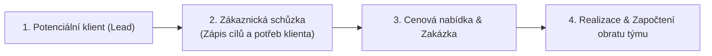

# Uživatelský průvodce: Koučování, Zákaznické schůzky a Diagnostika

Tento modul pokrývá individuální růst teampreneura:ky, kontakt se skutečným trhem a diagnostiku týmové dynamiky.

---

## 1. Zákaznické schůzky a obchodní pipeline

Praktické podnikání vyžaduje přímý kontakt se zákazníky. Každý kontakt a schůzka se eviduje v modulu **Zákaznické schůzky**:

### Co se u schůzky eviduje:
- Název klienta a kontaktní osoba.
- Zástupci:kyně týmu, kteří se schůzky zúčastnili.
- Hlavní zjištěné potřeby klienta, navržené řešení a dohodnuté další kroky.
- Finanční potenciál a propojení s konkrétním týmovým projektem.

---

## 2. Individuální koučování (1v1 sezení)

Každý:ka studující má k dispozici certifikovaného kouče:ku, se kterým:kterou pravidelně absolvuje individuální rozvojová sezení (1v1).

### Jak sezení probíhá:
1. **Příprava témat:** Před sezením si v Tappce připravíš témata, která potřebuješ řešit (osobní rozvoj, překážky v týmu, kariérní směřování).
2. **Průběh koučování:** Kouč:ka tě nehodnotí ani nezkouší — klade otevřené otázky a pomáhá ti najít vlastní řešení.
3. **Zápis výstupů a akčních kroků:** Po sezení si do svého profilu zapíšeš klíčová uvědomění a konkrétní závazky do příště.

---

## 3. Diagnostické nástroje a testy

Tappka integruje standardní metodické nástroje pro měření týmového i individuálního posunu:

- **Rocket Model:** Diagnostika 8 klíčových dimenzí týmového fungování (Context, Mission, Talent, Norms, Buy-in, Resources, Courage, Results). Tým provádí hodnocení jednou za semestr.
- **Belbinovy týmové role:** Přehled o tom, jaké role jsou v týmu zastoupeny (Inovátor:ka, Koordinátor:ka, Tahoun:ka, Dotahovač:ka a další) a kde má tým slepá místa.
- **Birth Giving:** Metodický proces pro zrození nového projektu — od prvotní ideje přes ověření tržního potenciálu až po schválení týmem.
