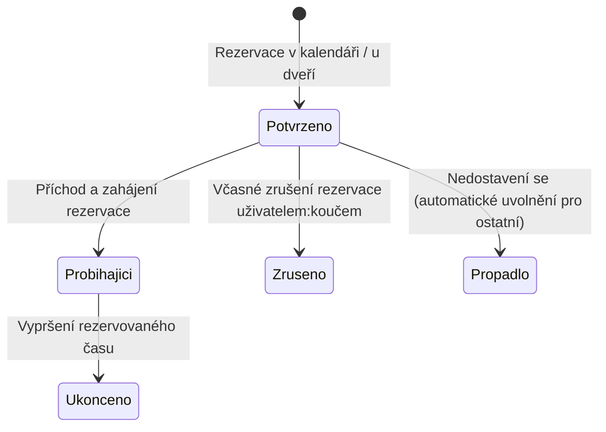

# Uživatelský průvodce: Rezervace místností v kampusu

Prostorové zázemí kampusu Tiimiakatemia Prague na ČZU PEF (kanceláře týmových firem, zasedací místnosti, koučovací zóny i studovny) je sdílené všemi studujícími i kouči:kami. Modul **Rezervace místností** v Tappce zajišťuje transparentní a férové rozdělení kapacit, eliminuje kolize a umožňuje rychlý přístup jak z počítače, tak přímo z mobilního telefonu na chodbě před místností.

---

## Životní cyklus rezervace

Každá rezervace prochází jasnými stavy od vytvoření až po uvolnění místnosti:

---

## Dva způsoby, jak si zarezervovat místnost

Podle situace můžeš zvolit plánování dopředu nebo okamžité zabrání volné místnosti u dveří.

### 1. Okamžitá rezervace u dveří přes NFC nebo QR kód

Přímo u vchodu do každé místnosti na kampusu se nachází fyzický dveřní plakát s NFC čipem a unikátním QR kódem. Tento způsob je ideální, když procházíš chodbou a potřebuješ se s týmem nebo klientem:klientkou hned někam posadit.

#### Postup u dveří:
1. **Přilož telefon k NFC čipu** (u iPhonu horní hranou, u telefonů s Androidem středem zadní strany) nebo **naskenuj QR kód** pomocí fotoaparátu telefonu.
2. V prohlížeči se okamžitě otevře stránka dané místnosti v Tappce (např. `/rezervace/d107`). Není potřeba místnost ručně vyhledávat v seznamu.
3. **Pokud je místnost volná:**
   - Objeví se zelený stav **Volno**.
   - Klepnutím na tlačítko zvolíš požadovanou délku (např. 30 minut nebo 1 hodinu) a místnost je okamžitě tvoje.
4. **Pokud je místnost obsazená:**
   - Uvidíš červený stav **Obsazeno**, včetně informace, kdo má prostor zarezervovaný a v kolik hodin blok končí.

Dveřními plakáty jsou v kampusu vybaveny místnosti:
- **D107** — Hlavní velká zasedací místnost
- **D126** — Týmová pracovna a zasedačka
- **D127** — Týmová zasedací místnost
- **D129** — Projektová pracovna
- **D132** — Konzultační místnost pro koučování
- **D226** — Horní zasedací místnost

---

### 2. Plánovaná rezervace předem v kalendáři

Pokud s týmem připravujete klientskou prezentaci, Training Session nebo koučovací sezení na konkrétní den v týdnu, rezervuj si prostor v předstihu z počítače nebo mobilu:

1. V levém menu Tappky přejdi do sekce **Rezervace**.
2. Zvol požadovaný den v kalendáři a vyber konkrétní místnost podle potřebné kapacity a vybavení (projektor, tabule, videokonference).
3. V časové mřížce klikni na požadovaný časový blok (minimální délka je 30 minut).
4. Vyplň stručný **účel rezervace** (např. *Klientská prezentace projektu SafeNest*, *Příprava rozvahy firmy*, *1v1 koučování*).
5. Klikni na **Potvrdit rezervaci**. Místnost se ihned zablokuje pro všechny ostatní uživatele:uživatelky.

---

## Přehled mých rezervací a jejich správa

Všechny své aktivní i minulé rezervace najdeš přímo v horní části stránky **Rezervace**:
- **Zrušení rezervace:** Pokud víš, že schůzka odpadla, klikni u své rezervace na tlačítko **Zrušit**. Místnost se okamžitě vrátí do kalendáře jako volná.
- **Předčasné uvolnění:** Pokud vaše setkání skončilo dříve, než byl původní plán, uvolni místnost v aplikaci, aby ji mohl využít jiný tým.

---

## Pravidla kampusu a férové využívání prostor

1. **Pravidlo včasného uvolnění:** Nikdy neblokuj prostor „pro jistotu“. Pokud se vaše plány změní, zruš rezervaci okamžitě.
2. **Přednost klientských schůzek:** Schůzky se skutečnými platícími zákazníky a externími partnery mají v reprezentativních zasedačkách (D107, D126) přednost před interním samostudiem.
3. **Semestrální bloky (Training Sessions):** Pravidelné tréninky celých týmových firem nastavuje na začátku semestru koordinátor:ka kampusu, aby byly prostory spravedlivě rozděleny mezi všechny ročníky.
4. **Pořádek v místnosti:** Po skončení rezervace uveď místnost do původního stavu — smaž tabuli, zasuň židle a vyvětrej.
