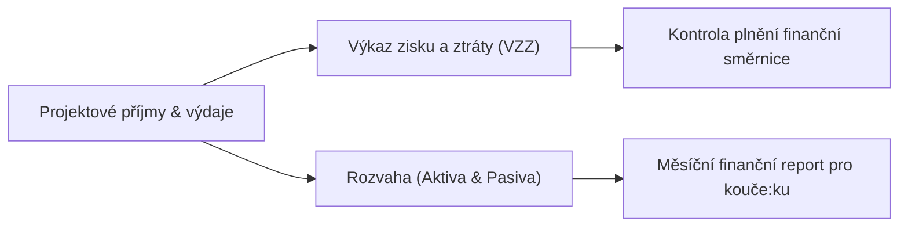

# Uživatelský průvodce: Týmová firma, Finance a Řízení

V Tiimiakatemia studující zakládají a řídí skutečnou studentskou týmovou společnost (nejčastěji s.r.o. nebo z.s.). Tappka poskytuje digitální infrastrukturu pro správu týmové governance, smluv i finančních toků.

---

## 1. Týmová smlouva a vedoucí myšlenky (Leading Thoughts)

Na začátku každého akademického roku tým sepisuje klíčové dokumenty:

1. **Týmová smlouva (Team Contract):** Pravidla spolupráce, docházky, řešení konfliktů a rozdělení odpovědností uvnitř týmu.
2. **Vedoucí myšlenky (Leading Thoughts):** Vize, mise, hodnoty a dlouhodobé cíle týmové firmy na následující 3 roky.

Všechny tyto dokumenty jsou v Tappce archivovány ve verzované podobě, takže se k nim tým i kouč:ka mohou kdykoliv vrátit při semestrálních reflexích.

---

## 2. Správa financí a účetnictví

Každá týmová firma hospodaří se skutečnými penězi z realizovaných projektů. V sekci **Týmové finance** tým eviduje:

### Přehled výkazů:
- **Finanční směrnice:** Nastavení minimálního obratu na člena:členku, pravidel pro reinvestice do vzdělávání a fondů společnosti.
- **Výkaz zisku a ztráty (VZZ):** Průběžný přehled o tržbách z projektů a provozních nákladech.
- **Rozvaha (Aktiva a Pasiva):** Stav firemního bankovního účtu, pohledávky za klienty a závazky vůči dodavatelům.

---

## 3. Týmový deník a Training Sessions (TS)

Dvakrát týdně probíhají čtyřhodinové týmové dialogy (Training Sessions).

- **Zápis z TS:** Každé sezení má určeného zapisovatele:zapisovatelku, který:která do Tappky zaznamenává probraná témata, byznysová rozhodnutí a zpětnou vazbu.
- **Deník akčních kroků:** Z každého sezení vznikají konkrétní úkoly s přiřazeným termínem a odpovědnou osobou.
- **Pravidelná reflexe (9měsíční kalendář):** Každý měsíc tým provádí strukturovanou reflexi podle metodiky Tiimiakatemia a hodnotí svůj posun.
